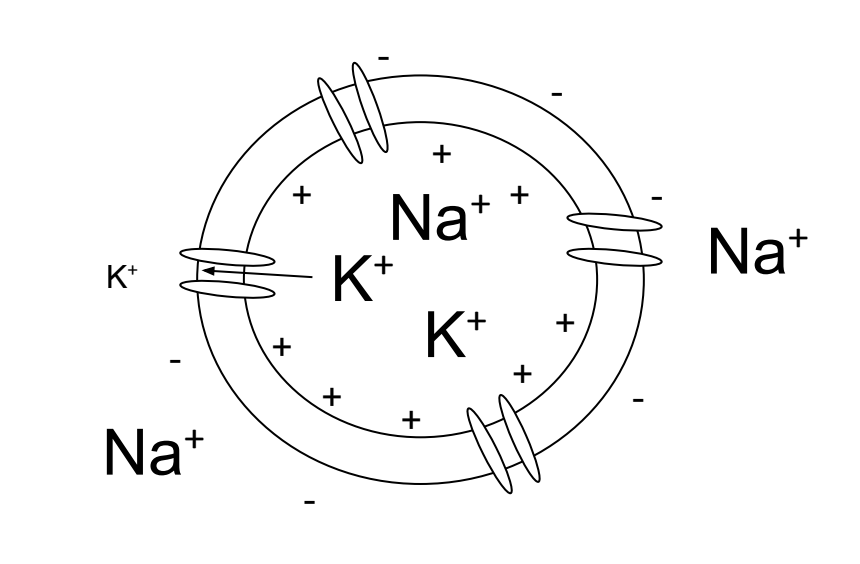

# Passive Membrane Models {#Ch3}

## Vocabulary  
* Depolarization
* Positive Feedback
* Hyperpolarization
* Negative Feedback
* Membrane Potential
* Sodium-Potassium Pump
* Nernst Potential
* Reversal Potential
* Equilibrium Potential
* Driving Force
* Conductance
* Leak Current
* Leaky Integrate and Fire Model

## Introduction  

## What is an action potential?  

Before going into ways of modeling action potentials, let’s further explore what an action potential is. Within a cell, there are more sodium ions outside the membrane, which have a positive charge. Because there are less positive ions inside the cell compared to the outside, the inside of the cell has a negative resting potential. When there is a spike of voltage, that causes both voltage-gated sodium and potassium channels–meaning that these channels activate and inactivate at certain voltages–to activate on a neuron’s membrane.  However, the sodium channels open much faster than the potassium channels. The flow of sodium ions into the cell causes the membrane potential to become more positive.  This process of positive ions flowing into the cell is called **depolarization**.  When depolarization happens, it causes additional sodium channels to open, which causes further depolarization---this phenomenon is called **positive feedback**, and the positive feedback starts if the depolarization hits a set threshold.  In other words, a positive feedback loop is a process that perpetuates itself.  The positive feedback loop ends once voltage-gated potassium channels also open at the peak of the action potential and potassium begins flowing out of the cell and ending depolarization, we call this **repolarization**. When the voltage is below the resting potential, we call this undershoot **hyperpolarization**, which is when the membrane potential decreases towards a move negative value via potassium ions flowing out.  As the voltage-gated potassium channels open and the voltage-gated sodium channels to close or become inactivated, there is now **negative feedback**. Negative feedback is a process by which an initial change is opposed by a force caused by the initial change.  In this situation, the positive feedback causes a spike in membrane potential and the negative feedback stabilizes. 

```{r channel1-fig, fig.cap="A cell at rest has more potassium ions intracellular than extracellular and more sodium ions extracellular than intracellular. There is a negative net charge within the cell being maintained by the  voltage gradient.", fig.width = 2, echo=FALSE}
knitr::include_graphics("images/channel1.png")
```

```{r channel2-fig, fig.cap="When the cell becomes depolarized sodium ions enter the cell. The charge within the cell becomes more positive.", fig.width = 1, echo=FALSE}

```

```{r channel3-fig, fig.cap="When the cell repolarizes potassium ions leave the cell. The charge within the cell go from positive to negative as it goes back to the resting state.", fig.width = 1, echo=FALSE}
knitr::include_graphics("images/channel3.png")
```

```{r actionPotential-fig, fig.cap="Example of an action potential.", fig.width = 2, echo=FALSE}
knitr::include_graphics("images/actionPotential.png")
```
  

## Nernst equilibrium potential  

  The electrical activity generated in a neuron is a result of ions flowing across the neuron’s membrane which is caused by the following two principles: opposite charges attract, and concentration gradients seek to equalize. This potential difference is referred to as the **membrane potential**. In order for ions to flow, a concentration gradient must be established because the difference in concentration across the membrane leads it to pass either into the neuron or out of the neuron. This is accomplished by the **sodium-potassium pump**, which uses just below 10% of your body’s daily energy to pump three sodium ions out of the neuron for every two potassium ions pumped in, thus forming two respective concentration gradients.
  
  With the concentration gradient established, the sodium and potassium ions will flow down the concentration gradients when their respective channels open, generating an electrical current that propagates down the axon. We must also take into account the fact that each ion possesses a charge–or charges in the case of Ca++ and Mg++–and that as this charge is built up on one side of the cell, this will generate an electrical force that will begin to repel ions with similar charge as they try to flow down their concentration gradient. When the force of the concentration gradient matches the electrical force attracting or repelling the ion, this is known as the **Nernst potential** for that ion, also referred to as the **reversal potential**. This means that means that both sodium and potassium possess their own respective Nernst potentials. Nernst potentials are especially important because they allow us to calculate the membrane voltage when a particular ion is in equilibrium, which helps to define the role it plays in an action potential.  
  
  The Nernst potential for an ion can be derived from the following equation: $$E_{ion} = \frac{RT}{zF}ln(\frac{[out]}{[in]}) $$

| Expression | Meaning |
|-----|-----|
| $E_{ion}$ | Nernst potential |
| R | Gas constant: 8.314 $J/mol \cdot K$ |
| ln() | Natural log |
| z | Valence |
| T | Temperature in Kelvin |
| F | Faraday constant: 96485.3 C/mol |
| [out] | Extracellular ion concentration |
| [in] | Intracellular ion concentration |

  While the Nernst potential will give the equilibrium point for a single ion, it also has a relation to the **equilibrium potential** or the resting potential the membrane, which is potential at which there is no net flow of ions, leading to a halt in the flow of electric current. The equilibrium potential is really a weighted average of all of the Nernst potentials and is modeled by the Goldman-Hodgkin-Katz equation which is shown below:  $$V_{m} = \frac{RT}{F}ln(\frac{P_{K}[K+]_{out}+P_{Na}[Na+]_{out}+P_{Cl}[Cl-]_{in}}{P_{K}[K+]_{in}+P_{Na}[Na+]_{in}+P_{Cl}[Cl-]_{out}}) $$
  
  This equation utilizes the membrane permeability, *P*, in conjunction with the concentration of each ion inside and outside of the cell to produce the equilibrium potential of a membrane. Using this equation alongside the Nernst potential, the **driving force**, which is a representation of the pressure for an ion to move in or out of the cell, can be calculated using the following equation: $$DF = V_{m}-E_{ion} $$
  
  The Nernst Potential, the Goldman-Hodgkin-Katz equation, and the driving force present necessary calculations that allow for better understanding of the flow of ions in relation to an action potential.  
  
**Worked Example:**  
Consider the following table of ion concentrations and relative permeabilities:  

|  Ion  |  Intracellular concentration (mM) | Extracellular concentration (mM) | Permeability |
|-----|-----|-----|-----|-----|
|  K+  |  150  | 4 | 1 |
|  Na+  |  15  | 145 | 0.05 |
|  Cl-  |  10  | 110 | 0.45 |  

If the extracellular concentration of Na+ was increased by a factor of ten:  
    a. What is the new Nernst potential for sodium?  
    b. What is the resting potential of the neuron?  
    
*Solution, part a*  
The Nernst equation is: $E_{ion} = \frac{RT}{zF}ln\frac{[ion]_{outside}}{[ion]_{inside}}$ in which:  

* R is the ideal gas constant: 8.314 $kg \cdot m^2 \cdot K^{1} \cdot mol^{-1}s^{-2}$
* T is the temperature in Kelvin: (310 K at human temperature)
* z is the valence. Here, we use +1 because the Na+ ion has a charge of +1.
* F is Faraday's constant: 96.49 $kJ \cdot V^{-1} \cdot mol^{-1}$
* Extracellular sodium is increased by a factor of 10: $[Na+]_{outside}$ = 10 * 145 mM = 1450 mM.

From these values:  
$$E_{Na+} = \frac{8.314 \cdot 310}{1 \cdot 96.49} \cdot \ln \frac{1450}{15}$$
$$E_{Na+} = \frac{2577.34}{96.49} \cdot \ln(96.67)$$
$$E_{Na+} = 26.7109545 * (4.5713031) = 122.1 mV$$
Therefore, if the extracellular concentration of sodium was increased tenfold, the new Nernst potential for sodium would be **122.1 mV**.  

*Solution, part b*:  
We will use the Goldman Hodgkin Katz (GHK) equation to find the resting potential of the neuron:  
$$V_{m} = \frac{RT}{F}ln(\frac{P_{K}[K+]_{out}+P_{Na}[Na+]_{out}+P_{Cl}[Cl-]_{in}}{P_{K}[K+]_{in}+P_{Na}[Na+]_{in}+P_{Cl}[Cl-]_{out}}) $$  

From the values given above:  
$$V_{rest} = \frac{8.314 \cdot 310}{1 \cdot 96.49} \cdot \ln \frac{(.05*1450)+(1*4)+(.45*10)}{(.05*15)+(1*150)+(.45*110)}$$  
$$V_{rest} = \frac{2577.34}{96.49} \cdot \ln \frac{72.5+4+4.5}{75+150+49.5}$$
$$V_{rest} = 26.71099545 \cdot \ln \frac{81}{200.25} = -24.18 mV$$  
If the extracellular concentration of sodium was increased by a factor of 10, the neuron’s resting potential would be -24.2 mV instead of -70 mV.  

**Worked Example:**
Consider the unicorn neuron’s resting potential. Due to their mythical identity and magic, the resting potential for a unicorn neuron is different than that of humans. Unlike humans, unicorns have a *magic ion* that alters their resting potentials. The relevant ion concentrations and permeabilities are found in the table below:  

|  Ion  |  Intracellular concentration (mM) | Extracellular concentration (mM) | Permeability |
|-----|-----|-----|-----|-----|
|  K+  |  150  | 4 | 1 |
|  Na+  |  15  | 145 | 0.05 |
|  Cl-  |  10  | 110 | 0.45 |  
|  Magic+ | 200 | 30 | 1.1 |  

a. What is the Nernst potential for the magic ion of the unicorn neuron, assuming magic+ moves just as other ions do?  
b. What is the resting potential of the unicorn neuron?  

*Solution, part a*:  
The Nernst equation is: $E_{ion} = \frac{RT}{zF}ln\frac{[ion]_{outside}}{[ion]_{inside}}$ in which:  

* R is the ideal gas constant: 8.314 $kg \cdot m^2 \cdot K^{1} \cdot mol^{-1}s^{-2}$
* T is the temperature in Kelvin: (310 K at human temperature)
* z is the valence. Here, we use +1 because the Magic+ ion has a charge of +1.
* F is Faraday's constant: 96.49 $kJ \cdot V^{-1} \cdot mol^{-1}$
* Extracellular sodium is increased by a factor of 10: $[Na+]_{outside}$ = 10 * 145 mM = 1450 mM.

From these values:  
$$E_{Na+} = \frac{8.314 \cdot 310}{1 \cdot 96.49} \cdot \ln \frac{30}{200}$$
$$E_{Na+} = \frac{2577.34}{96.49} \cdot -1.90 = -50.8 mV$$
The Nernst potential of the magic+ ion is -50.8 mV. Thus the ionic and concentration gradients are at equilibrium for the magic+ ion when the potential difference of the neuron is -50.8 mV.  

*Solution, part b:*  
Here, we will expand the Goldman Hodgkin Katz equation to include the magic+ ion:  
$$V_{m} = \frac{RT}{F}ln(\frac{P_{K}[K+]_{out}+P_{Na}[Na+]_{out}+P_{Cl}[Cl-]_{in} +P_{Magic}[Magic+]_{out}}{P_{K}[K+]_{in}+P_{Na}[Na+]_{in}+P_{Cl}[Cl-]_{out}+P_{Magic}[Magic+]_{in}}) $$ 
From the values given in part a:  
$$V_{rest} = \frac{8.314 \cdot 310}{1 \cdot 96.49} \cdot \ln \frac{(.05*1450)+(1*4)+(.45*10)+(1.1*30)}{(.05*15)+(1*150)+(.45*110)+(1.1*200)}$$  
$$V_{rest} = \frac{2577.34}{96.49} \cdot \ln \frac{72.5+4+4.5+33}{75+150+49.5+220}$$
$$V_{rest} = \frac{2577.34}{96.49} \cdot \ln \frac{72.5+4+4.5}{75+150+49.5}$$


$$V_{rest} = 26.71099545 \cdot \ln \frac{48.75}{420.25} = -57.3 mV$$
The resting potential of the unicorn neuron is -57.3 mV. This happens as a result of the permeabilities and concentrations of all four ions in this example, especially as a result of the magic+ ion's high permeability. This makes the resting potential most similat to its Nernst potential.  

## Leaky Integrate and Fire Model  

**Worked Example: Deriving the Integrate and Fire Model**  
In the leaky integrate and fire model, we are modeling the membrane as a resistor-capacitor (RC) circuit and injecting into the cell some external current, $I_e$. By Kirchhoff's rule, we know that the the sum of all currents sums to zero. This means that the external current is the sum of a resistive current and a capactive current:  
$$I_e = I_R + I_C$$

The resistive current is the current that flows through ion channels. Therefore, by Ohm's law, it is the product of the membrane conductance ($g_L$) and the driving force (the difference between the present membrane potential, $V_m$, and the resting membrane potential, $E_L$):
$$I_R = g_L(V_m-E_L)$$
Because the cell is negatively charged with respect to the outside, and because the membrane is very thin, negative charges build up along the inside of the membrane and attract positive charges on the outside. This means that the membrane is acting as a capacitor! The amount of charge (Q) that can be stored by the membrane is given by the capacitance equation:
$$C_mV_m = Q$$
Where $C_m$ is the specific capacitance of the membrane, or its ability to store charge. Therefore, the capacitive current is:
$$I_C = \frac{dQ}{dt} = C_m\frac{dV_m}{dt}$$
Putting this all together, we get:
$$ C_m \frac{dV_m}{dt} = I_e - g_L(V_m-E_L)$$
Ultimately, we want to solve for $V_m$, so let's first multiply both sides by $R_m$. 
$$ \tau_m \frac{dV_m}{dt} = R_m I_e + E_L-V_m$$
This is because the time constant, $\tau_m$ is equal to the product of $R_m C_m$. We need to solve this differential equation for $V_m$. We can see from the above equation that the change in membrane potential is some fraction of the difference between the present membrane potential $V_m$ and $R_m I_e + E_L$. Therefore, we know that the membrane will approach $R_m I_e + E_L$ over time. We will therefore define this as the steady-state voltage $V_\infty$. Therefore, the solution to V(t) is:  
$$V(t) = V_\infty + (V(0)-V_\infty)e^{\frac{-dt}{\tau_m}}$$
Where V(0) refers to the previously calculated voltage.  

This is the equation we have been working towards! Let's perform some hand calculations. This is not efficient by any means, and this illustrates the application and practicality that computer programming has to offer neuroscience.  

Let's first compute V(t) from a resting potential V(0) of -70 mV when there is no injected current. Recall that:  
$$V_\infty = R_m I_e +E_L$$
If there is no injected current ($I_e=0$), then $V_\infty=E_L = -70 mV$. Therefore, V(t) is equal to the resting potential when there is no injected current. Let's use this equation to now calculate V(t) at the moment that $I_e$ is turned on to 0.5 nA. Let's start with $V_\infty$:

$$V_\infty = 10 M \Omega \cdot 0.5 nA - 70 mV = -65 mV$$
This means that if we left the external stimulation on for a long time, the membrane would reach -65 mV. Let's put this into the full equation using a $\tau_m = 10 ms$ and a dt of 0.1 ms.

$$ V(t) = -65 mV + (-70 mV - -65 mV)e^{\frac{-.1}{10 ms}}$$
$$V(t) = -65 mV + (-5)*.99 = -69.95 mV$$
In this way, we can work through, voltage by voltage, using the present voltage to calculate the next. But computers make this process much faster as you will see below.  

**Worked Example:**  
Johnny Firehydrant has just begun an investigative neurological study, focusing on memory. He has been trying to develop a model of how the hippocampus fires. Johnny’s model will begin with the CA1 neurons. He decided that this was an important place to begin because it receives inputs from CA2 and CA3 regions and it also outputs information to the Entorhinal cortex and the Subiculum; so the behavior of receiving, integrating, and firing is crucial for modelling the hippocampus. Using the leaky integrate-and-fire model of neuron ‘A’, run a simulation for 500 ms in time increments of 0.05 ms starting at the membrane’s resting potential of -70 mV. For the first 100 ms, Johnny is using a 0.5 nA injected current, from 125 ms to 200 ms he injects 1.3 nA, and between 250 ms and 350 ms the injected current is increased to 2.0 nA. You may assume the following values:  

* $R_m = 10 M\Omega$
* $\tau_m = 10 ms$
* $V_{threshold} = -55 mV$
* $V_{reset} = -75 mV$
* $V_{spike} = 20 mV$

Before we begin, here is a key of symbols and their meaning:  

* $\tau_m$: The membrane time constant.
* $I_e$: The external current that is injected into cell.
* $E_m$: The membrane's resting potential.
* $R_m$: The membrane resistance.
* $g_L$: Leak conductance.
* $V_m$: Membrane potential.

**Step 1:**  Import numpy and matplotlib libraries for Python operations. Then assign variables to the parameter values provided above.  

```{python, eval=FALSE}
# Import essential libraries
import numpy as np
import matplotlib.pyplot as plt

# Set simulation parameters
Vthresh = -55   #mV
Vreset  = -75   #mV
Vspike  =  20   #mV
Rm      =  10   #MOhms
tau     =  10   #ms
dt      =  0.05 #ms
counter =  0

```

**Step 2:** Next, we will set up the data structures for holding our data.  
```{python, eval=FALSE}
# Creates a vector of time points from 0 to 499 ms in steps of dt=0.05
timeVector = np.arange(0, 500, dt)

# Creates a placeholder for our voltages that is the same size as timeVector
voltageVector = np.zeros(len(timeVector))

# Creates a placeholder for the external stimulation vector.
# It is also the same size as the time vector.
stimVector = np.zeros(len(timeVector))
```

**Step 3:** We will now set our initial conditions  
```{python, eval=FALSE}
# Set the initial voltage to be equal to the resting potential
voltageVector[0] = Vrest
```

**Step 4:** At this point you want to arrange Johnny’s applied current pulses according to time. (remember that the dt=0.05, so there are 20 time points per millisecond.)  
```{python, eval=FALSE}
# Sets the external stimulation to 0.5 nA for the first 100 ms
stimVector[0:2000] = 0.5

# Sets the external stimulation to 1.3 nA between 125 and 250 ms
stimVector[2500:4000]= 1.3

# Sets the external stimulation to 2.0 nA between 250 and 350 ms
stimVector[5000:7000] = 2.0
```

**Step 5:** Use a for-loop to use the present voltage value to compute the next voltage value.  
```{python, eval=FALSE}
# This line initiates the loop. "S" counts the number of loops.
# We are looping for 1 less than the length of the time vector
# because we have already calculated the voltage for the first
# iteration.
for S in range(len(timeVector)-1):
  # Vinf is set to equal the resting potential plus the product
  # of the stimulation vector at the Sth time point.
  Vinf= Vrest + Rm * stimVector[S]
  
  # The next voltage value is is equal to where we are going (Vinf)
  # plus the product of the different between the present voltage and
  # Vinf (how far we have to go) and e^-t/tau (how far we are going
  # in each step)
  voltageVector[S+1] = Vinf + (voltageVector[S]-Vinf)*np.exp(-dt/tau)
  
  # This 'if' condition states that if the next voltage is greater than
  # or equal to the threshold, then to run the next section
  if voltageVector[S+1] >= Vthresh:
     # This states that the next voltage vector will be the Vspike value
     voltageVector[S+1] = Vspike
     
     # This 'if' statement checks if we are already at Vspike (this is
     # another way we can be above Vthresh)
     if voltageVector[S] == Vspike:
      
        # Set the next voltage equal to the reset value
        voltageVector[S+1] = Vreset
        
        # This will count the number of observed spikes so that spike count
        # rate may be calculated later
        counter += 1
```

**Step 6:** Now, we just have to plot the simulation.  
```{python, eval=FALSE}
# This sets the new plot object
plt.figure()

# This plots the voltage (y-axis) as a function of time (x-axis)
plt.plot(timeVector, voltageVector)

# This labels the y-axis
plt.ylabel('Voltage in mV')

# This labels the x-axis
plt.xlabel('Time in ms)

# This sets the title
plt.title('Voltage versus time)
```

The final graph looks like this:  
```{r integrateFire-fig, fig.cap="Output of sample code", fig.width = 2, echo=FALSE}

```

**Step 7:** Explore your simulation  
Now that you have designed an algorithm to plot Johnny's experiment you are capable of learning a few characteristics of the design. For example, if you are curious about the voltage at a particular time step, you can read it out of the voltage vector. For instance, if you wanted to know the voltage at time point 2540 you would type:
```{python, eval=FALSE}
print(voltageVector[2540])
```

If you wanted to change the strength of the applied stimulation, or the duration of each pulse, you may edit these lines:
```{python, eval=FALSE}
stimVector[0:2000] = 0.5
stimVector[2500:4000]= 1.3
stimVector[5000:7000] = 2.0
```

**Worked Example:**  
Johnny has now developed a general model of how a hippocampal neuron fires. But Mr. Firehydrant wants to know how both the length of the stimulation pulse and the strength of that pulse interact to influence the neuron's firing. Johnny devises the following stimulation protocol:  

* At time zero, the cell is at rest. When the cell is not being stimulated, it is allowed to go back to rest.
* At 0.5 ms, 5 nA of current is injected into the cell for one time step.
* From 50 to 54 ms, 5 nA are injected into the cell.
* At 150 ms, the applied current is turned back on at 15 nA for one time step.
* From 200 ms to 202 ms, the current is held at 15 nA.
* At 250 ms, there is a 30 nA pulse of injected current for one time step.
* From 300 to 301 ms, the applied current is 30 nA.

This appears more difficult than it is, and much of what you did for the previous example will help here. Graph the cell's voltage over time as well as the external current over time. Notice how increasing the duration of the current pulse provides an additive effect in bringing the cell's membrane potential closer to threshold.  

Most of your previous simulation can be recycled in full. You will make changes to two sections: defining your stimulation vector, and in adding a second graph. Here, we set the stimulation protocol.  

```{python, eval=FALSE}
# Begin by setting the default stimulation level to 0
stimVector = np.zeros(len(timeVector))

# At 0.5 ms, 0.5 nA of current is injected
stimVector[1] = 5

# From 50 to 54 ms, 5 nA are injected into the cell
stimVector[999:1080] = 5

# At 150 ms, 15 nA is injected for one time step
stimVector[2999] = 15

# From 200-202 ms, the current is held at 15 nA
stimVector[3999:4040] = 15

# A pulse of 30 nA at 250 ms
stimVector[4999] = 30

# From 300 to 301 ms, the applied current is 30 nA
stimVector[5999:6020] = 30
```

And this code snippet creates our two plots.  
```{python, eval=FALSE}
# This sets the plot object
plt.figure()

# This defines that we are plotting into the top plot
plt.subplot(2,1,1) # two rows, one column, first graph

# Plots time on the x-axis and current on the y-axis
plt.plot(timeVector, stimVector)

# Labels the x-axis
plt.xlabel('Time in ms')

# Labels the y-axis
plt.ylabel('External current in nA')

# Titles the plot
plt.title('External Stimulation vs Time')

# This defines that we are plotting into the top plot
plt.subplot(2,1,2) # 2 rows, 1 column, 2nd graph

# Plots time on the x-axis and voltage on the y-axis
plt.plot(timeVector, voltageVector)

# Labels the x-axis
plt.xlabel('Time in ms')

# Labels the y-axis
plt.ylabel('Membrane potential in mV')
```

The plot looks like this:  
```{r integrateFire2-fig, fig.cap="Output of sample code", fig.width = 2, echo=FALSE}
knitr::include_graphics("images/integrateFire2.png")
```

## Summary

## Exercises  

### Conceptual Exercises  

1. Describe the life cycle of an action potential. Be sure to include changes in channels/pumps, ion movement, and voltage.  

2. Explain why the resting potential is a steady state and how ion permeability and Nernst potential play a role.  

3. What does the Goldman-Hodgkin-Katz (GHK) equation tell you and when should it be used?  

4. What are the different ways molecules can move across the membrane of the neuron?  

5. Water flow  abides by similar rules as ions flowing across a membrane in a neuron. Match each aspect of ion flow to water flow below. Explain your reasoning.  

6. Explain how depolarization and hyperpolarization relate to positive/negative feedback. 

```{r dam-fig, fig.cap="Match each part of the water flow in this dam to ion flow in a neuron.", fig.width = 2, echo=FALSE}
knitr::include_graphics("images/SQK_Dam_DSC_3657.jpg")
```

|  Water Concept  |  Neural Concept |
|-----|-----|
|  Water  |  Voltage-gated channel  |
|  Dam  |  Ions  |
|  Jet  |  Ion pump  |  

6. Explain the basic function of the leaky integrate and fire model. Your response should describe both the RC membrane circuit as well as the logical rules governing the model neuron's firing.  

7. Describe one aspect of the leaky integrate and fire model that is not biologically realistic.  

8. Briefly explain the concept of driving force.  

9. Explain the difference between the membrane potential, Nernst potential and equilibrium potential. 


### Coding Exercises  
1. Let us walk through calculating the Nernst potential in Python. 1.	Shown below is the Nernst equation that allows us to calculate the Nernst potential (AKA: reversal potential, resting potential) of the crucial ions (Na+, K+, Cl-) in our body that make action potentials possible.  
$$E_{ion} = \frac{RT}{zF}ln(\frac{[out]}{[in]}) $$
Okay, I know this equation may seem to be made up of lots of different variables, but it really is not. Let’s break it down together:  

* R and F are both constants.
* T is our body temperature.
* So, $\frac{RT}{F}$ is about 26.5 mV.
* z is the charge of the given ion. (*Hint: Na+: +1, K+: +1; Cl-: -1*)
* *[out]* and *[in]* refer to the ion concentrations on the extracellular, and intracellular sides of the membrane, respectively.

(a) Our goal is to create a general Python function that will predict whether the Nernst potential for Na+, K+, or Cl- will be positive or negative. The advantage of writing a function is that we will be able to write one piece of code that can be re-used for each ion by substituting in the relevant values. Right now, we only care about the relative concentrations, so we can just use **1** to represent the side with the lower concentration, and **2** for the side with the higher ion concentration. Use the following steps to construct your function:  

* Open a blank Jupyter notebook.  
* Import the necessary Python libraries. (*Hint: numpy is useful for calculation. In Python, ln() implemented in the log() function*)  
* Set up the general function definition. (*Hint: Use "def" and "return" to set up a function named "Eion" with three arguments. The constants in the Nernst equation will not affect our results, so we may omit them for now.*)  
* Try out your function for each of the three major ions and print out the results. (*Hint: Think about the relative concentration of each ion inside and outside of the neuron during the resting state. Remember that Cl- is tricky!*)  

(b) Good job! Now, let's apply your function to calculate more realistic Nernst potentials for Na+, K+, and Cl- given their actual ionic concentrations:  

|  Ion  |  Intracellular concentration (mM) | Extracellular concentration (mM) |
|-----|-----|-----|-----|
|  Na+  |  15  | 145 |
|  K+  |  150  | 4 |
|  Cl-  |  10  | 110 |  

Pro-tip: We are still using the same Jupyter notebook as part (a), we do not have to import numpy again! Lazy is good. 

Use the following steps to apply your function:  

* Set up the general function. (*Hint: alter your Eion function to use the R and F constants as well.*)  
* Use the values from the table in order to print out the Nernst potential for each ion.  

(c) Sort the Nernst potentials from smallest to largest. Print the name of the ion that is closest to the neuron's resting potential (-65 mV).  

2. As we previously learned, the resting potential of the neuron can be predicted by the Goldman Hodgkin Katz (GHK) equation as follows:  
$$V_{m} = \frac{RT}{F}ln(\frac{P_{K}[K+]_{out}+P_{Na}[Na+]_{out}+P_{Cl}[Cl-]_{in}}{P_{K}[K+]_{in}+P_{Na}[Na+]_{in}+P_{Cl}[Cl-]_{out}}) $$  
The first part of the equation looks similar to the Nernst equation - great!  
$$V_{m} = 26.5 \cdot \ln(\frac{P_{K}[K+]_{out}+P_{Na}[Na+]_{out}+P_{Cl}[Cl-]_{in}}{P_{K}[K+]_{in}+P_{Na}[Na+]_{in}+P_{Cl}[Cl-]_{out}}) $$   

But what the heck is going on inside the parentheses?  

The resting potential is dependent on and made up of these three ions. Therefore, we are weighting each ion according to its relative permeability value. The relative permeability value reflects the ease with which each ion can pass through the membrane at rest. By convention, we assign $P_{K+}$ to be 1. The membrane is far less permeable to sodium ($P_{Na+} = 0.05$), and moderately permeable to chloride ($P_{Cl-} = 0.45$). These values reflect the relative density of leak channels for K+, Na+, and Cl- in the membrane.  

(a) Create a general Python function to calculate the resting potential of a neuron from the previously provided values. Use the following steps:  

* Import the necessary Python libraries.  
* Set up the general function. There are six different concentrations that can be considered as input arguments. For simplicity, you may "hard code" the permeability of Na+ and K+ inside your function. Please put Cl- permeability as an argument to your function because you will use it in the next question. (*Hint: take a close look at the equation. Cl- is different!*)  

(b) Early in development (when we were babies), it is found that intracellular concentration of Cl- ions is higher than the extracellular concentration of Cl-. This is due to the delayed expression of Cl- exporters in the membrane. All else being equal, how would this affect the resting potential? Would the neuron be more or less likely to fire an action potential in this state?  

To simplify, assume that $p_{Cl} = 0.1$ because there are fewer exporters. Let's assume that [ion] and [out] are switched for this problem.  