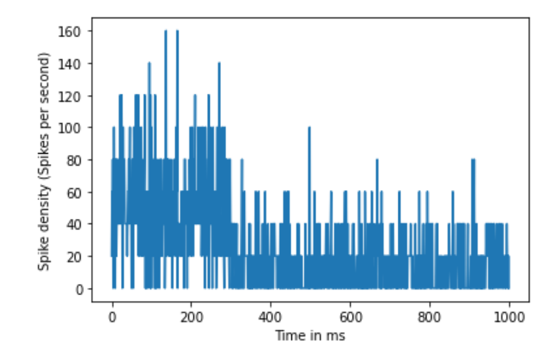

# Firing Rates {#Ch5}  

## Vocabulary  

## Introduction  

## Spike Trains  
<div style = "float:right;width:561px">
```{r spikeTrain-fig, fig.cap="Example of a spike train. Graph A shows the recorded stimulus and graph B shows the recorded actions potentials during the stimulus.", fig.width = 2, echo=FALSE}
knitr::include_graphics("images/spikeTrain.png")
```
</div> 

  Assume that we measured a neuron firing in response to a sensory stimulus, and we recorded its voltage changes and displayed the signal in an oscilloscope. How should we analyze the information encoded in these action potentials? As we mentioned before, the action potential is an all-or-none event. This binary characteristic gives us a way to simplify the complicated voltage response curve: for every time point in our measurement, if there is a spike firing, denote its value as 1; if not, denote it as 0. After the recording, we get a sequence of 0s and 1s in a time-dependent order. We commonly refer to this sequence as a spike train, shown in Figure 1, part B.  
  
  
  Since all action potentials fire to the same voltage level, there is no difference in their intensities. Thus, in order to have action potentials that convey meaningful information, neurons can only vary on timing of firing, including varying firing rates or varying the time intervals between each firing. Although this seems super-simplified, our spike train contains mostly the information we need to analyze if we want to know what causes the original neuron to fire. In order to systematically analyze these data in spike trains, we first need to define some statistics.


## Spike Statistics  

  Now we have a sequence of 0s and 1s which represent neural firing, the next step is to calculate the **spike count rate**, which is the number of spikes divided over a given time interval. This parameter directly shows the firing rate, but it cannot reflect variation. Assume that we have two neurons that have the same spike count rate. One is a regular-firing neuron and the spikes are evenly distributed along the time axis, while the other is a bursting neuron that fires sets of spikes with longer intervals between individual sets. How can we distinguish between these two spike trains? Here, we want to introduce another parameter called the **interspike interval (ISI)** or in other words, the time interval between every pair of spikes. In Figure 2, there is a histogram that shows the distribution of ISIs from an artificial spike train. The ISI histogram can be characterized by **coefficient of variation (CV)**, which is the standard deviation of ISIs divided by the mean of it. Apart from that, we can also use the **Fano factor** to measure the spike variability. It is calculated by the variance of the number of spikes divided by the mean number of spikes in a given time interval. Compare to CV, Fano factor is less dependent on the intervals between spikes but more on the number of spikes in a given time bin. If the underlying firing rate varies or the spike firing in irregular time points, both CV and Fano factor increase. Thus, CV and Fano factors are useful secondary statistics that helps to measure variability in spike trains.  
  
```{r poissonISI-fig, fig.cap="Distribution of ISIs from a randomly firing artificial neuron.", fig.width = 2, echo=FALSE}
knitr::include_graphics("images/poissonISI.png")
```

  We can do a lot with a single spike train. However, in vivo, neural responses are highly variable and the response of a neuron to the same stimulus may even vary from trial to trial. Effectively, to account for the cross-trial variability, we need to analyze results from multiple trials to get a better estimate of the average neural response. A **peristimulus time histogram (PSTH)** can be generated by averaging across trials. The most direct method is to put trials in small time windows that correspond to each time point and calculate the spike count rate in window for each time point. By implementing this process, each time point is assigned an average rate, and by plotting we get a continuous frequency curve. One example is shown in the Exercise 1, in the "spike density" section, in which spikes are averaged in time windows, and then averaged across trials. In this case, all trials are run on the same neuron, which reduces the cross-trial variability and increases the time resolution. The response, however, may be affected by adaptation. Furthermore, we can also assess the firing pattern of a population of neurons by calculating the average spike counting rate for all the time points, and then averaging across trials. At this point, different trials are run on different neurons, and the generated response curve accounts for the response pattern of a population of neurons in the area that was tested. This method, while it generates better time resolution, omits the possible variability across neurons in the population. 
  Choosing different time windows influences the characteristics of the frequency curve, as shown in Figure 3. In general, PSTH is essential because it transforms a discontinuous spike train into continuous response curves, which allows us to calculate the correlation between stimulus and response. This will be further elaborated upon in the later sections.  
  
**Exercise 1:** What are the pros and cons for each type of histogram?  

```{r firingRateTable-fig, fig.cap="PSTH generated from different time windows. The size of the time window gets larger from top to bottom(0.005s, 0.025s, and 0.050s). While the smaller time window retains more information of the original spike train, the bigger time window gives a more smooth and continuous output.", fig.width = 2, echo=FALSE}
knitr::include_graphics("images/firingRateTable.png")
```


```{r firingRate1-fig, fig.cap="PSTH generated from different time windows. The size of the time window gets larger from top to bottom(0.005s, 0.025s, and 0.050s). While the smaller time window retains more information of the original spike train, the bigger time window gives a more smooth and continuous output.", fig.width = 2, echo=FALSE}
knitr::include_graphics("images/firingRate1.png")
```

  Sometimes, instead of collecting data from real neurons, we need to simulate spike trains from given statistics. The artificial spike trains can be compared with real data, or used to reconstruct possible firing patterns with a given stimulus. Here, we will discuss the homogeneous Poisson process, or the simplest way of generating artificial spike train. The homogeneous **Poisson process** entails that for every small interval on the timeline, the probability of an event happening (in our case, action potential) will be proportional to the length of the time interval, while the proportionality constant *r* is fixed. To understand this abstract definition, think about a timeline whereby at each time point, we throw a coin and record the head as 1. Try to visualize that timeline. We agree that all 1s will be randomly spread along the timeline, and the interval between when we get a pair of heads, varies along the timeline. This will look very similar to an artificial spike train generated by the Poisson process, whose distribution can be expressed by the following formula:  $$p(q\ spikes\ in\ \Delta{t}) = e^{-\lambda}\frac{\lambda^{n}}{n!} $$


```{r poisson-fig, fig.cap="An artificial spike train generated by Poisson process and its ISI distribution. Notice that the spikes are randomly distributed along the time axis, and the ISI histogram has an exponential distribution.", fig.width = 2, echo=FALSE}
knitr::include_graphics("images/PoissonSpike.png")
```


**Worked Example:**  
For this example, we will consider data collected by Robert Cat from a neuron located in an alien’s posterior inferior temporal cortex responding to a rapidly-changing color stimulus.  Dr. Cat recorded the neuron at 1000 Hz for ten seconds and created a Boolean vector (*spikes*) where 1 signifies a spike.  Create a program that calculates the neuron’s spike count rate, and then create a plot of the spike count rate versus time.  

```{python, eval=FALSE}
# First, import the necessary libraries
import numpy as np
import matplotlib.pyplot as plt

# Calculate the total number of spikes and store them in totalSpikes
# Because the vector is binary, the sum of the 1s and 0s gives the total
totalSpikes = np.sum(spikes)

# Calculate the neuron’s spike count rate, and store it in spikeRate
# We divide by 10 because we want our rate to be in the unit of spikes/second (Hz)
spikeRate = totalSpikes / 10

# Print the spike count rate
print('The spike count rate is: {} Hz'.format(spikeRate))
```

**Worked Example:**  
Next, we will examine how to calculate the rate as an average across 50 trials of the same neuron Dr. Cat obtained responding to the same stimulus using the spike density rate. In this experiment, each trial was one second long, and measurements were taken at 1000 Hz. Dr. Cat noticed in their research that the neuron fired at an average of 50 Hz for the first 300 ms of the recording and an average of 15 Hz for the remaining 700 ms. First, simulate the neuron in Dr. Cat's experiment and then, using this information, plot spike density rate versus time.  

```{python, eval=FALSE}
# As usual, we'll begin by importing the necessary libraries
import numpy as np
import matplotlib.pyplot as plt

# Define the two average spiking rates as probabilities
p1 = 50/1000 # on average, 50 spikes in the 1000 time points
p2 = 15/1000 # on average, 15 spikes in the 1000 time points

# In order to create the data, we will create a matrix that
# is numTrials by numTimePoints in size. We will initialize
# it with zeros and then fill in the spikes later.
dataMat = np.zeros((50, 1000))

# Here, we will create a nested loop. The outer loop will 
# loop through the 50 trials. The inner loop will loop through
# the time points and use a random number generator to determine
# the placement of each spike.

# Data creation loop of 50 trials
for j in range(50):

  # In each of the 50 trials, loop through 1000 time points
  for i in range(1000):
  
    # At each time point, we want the neuron to fire with 
    # probability p1 in the first 300 ms, and probability p2
    # for the remainder of the trial.
    
    # To do this, we will first create a conditional to determine
    # whether or not we are in the first 300 ms. If so, we will 
    # use p1, and if not, we will use p2.
    if i < 300:
      p = p1
    else:
      p = p2
    
    # At each time point, we flip a random coin using np.random.rand().
    # This generates a random value between 0 and 1. If this value
    # is less than our target probability, the neuron will fire.
    if np.random.rand() < p:
      dataMat[j, i] = 1
      
    # Note that we do not need an "else" here because the rest of the
    # matrix is already 0.
    
# Now that we have created our data, we can calculate the spike 
# density rate.

# Sum all the trials to plot the total number of spikes in each 
# time bin, and store them in counts (HINT: we wish to sum over 
# all the rows, and numpy denotes rows before columns. This is
# the reason we use axis=0 (i.e. the first axis))
counts = np.sum(dataMat, axis = 0)

# Now, we need to translate these counts into a rate by dividing
# by the number of trials and the dt
density = (1/(1/1000)) * counts/50

# In order to create a plot, we need to create a vector of time
# points to plot it against
time = np.arange(1000)

# Create spike density vs. time graph
plt.figure()
plt.plot(time, density)
plt.xlabel('Time in ms')
plt.ylabel('Spike density (Spikes per second)')
```

The resulting plot looks like this:
<div style = "float:left;width:564px">
```{r spikeDensity-fig, fig.cap="Spike density rate over 50 trials", fig.width = 2, echo=FALSE}

```
</div> 

## Summary  

## Exercises  

### Conceptual Problems
1. Define the spike count rate. What are the advantages and disadvantages of defining rate as a spike count?  
2. Define the spike density rate. What are the advantages and disadvantages of defining rate as a spike density?  
3. Define firing rates as population density. What are the advantages and disadvantages of defining rate as population activity?  
4. What are the qualifications for a Poisson spike train?  

### Coding Problems  
1. *Part a.* Create a Poisson spike train to simulate a neuron that fires for 2000 ms at an average rate of 50 Hz. The Poisson distribution is a useful concept to create random spike locations within a time frame (2000 ms in this case) that produce an average desired frequency (50 Hz in this case). The randomness can be achieved by using the np.random.rand() function, which generates a random value uniformly sampled between 0 and 1. If this random value is less than the specified probability of firing, than the code will generate a 1 indicating a spike. Otherwise, the spike train will contain zeros.  
*Part b* Using the following code template, add a counting variable to measure the number of spikes produced in the simulation. Use this total spike count to calculate the final spike count rate (spikes/second, or Hz) and see how it compares to the desired frequency of 50 Hz (50 spikes/second).
```{python, eval=FALSE}
# Import the necessary libraries
import matplotlib.pyplot as plt 
import numpy as np

# Initialize data structures
# Hint: your simulation runs for 2000 ms
timeVec =

# Hint: you may express your desired rate as a nSpikes / 1000 ms probability
probability = 

# Hint: you want the default value to be zero
spikes =

# Loop through each time point - fill in missing code
for i in range():
  if np.random.rand() < probability:
    # fill in this key line
    
# Compute the spike count rate here
spikeCountRate = 

# Print the spike count rate
print('The firing rate was: {} Hz'.format(spikeCountRate))

# Create a figure of the spike train
plt.figure()
plt.plot(timeVec, spikes)
plt.title('Spikes versus Time')
plt.xlabel('Time (ms)')
plt.ylabel('Spikes')
```

*Part c* Using your spike train, compute a histogram of interspike intervals (ISIs). To do this, it will be helpful to find the locations of your spikes in your spike train. The function np.where() will do this (hint: you will only need the first value returned in the tuple). Hint: you will have 1 fewer ISI than number of spikes in your spike train.  


2. *Part a* Using the same Poisson process as above, simulate an experiment in which 40 trials of 2000 ms are created and place all trials into a single array. Fill in the code snippet below to create your array and plot a raster plot of all trials.  
```{python, eval=FALSE}
# Import necessary libraries
import numpy as np
import matplotlib.pyplot as plt

#fill in the time vector and the spike frequency value of 50 Hz
timeVec = 
p1 = 

#Allocate space for the 40 trials x 2000 ms array
allTrials = 

#Create a Poisson spike generator, that loops 40 times for all 40 trials
for i in range():

    # For each trial, use an inner loop to represent all 2000 time points
    for v in range():

# Create the raster plot
for j in range(): # How many trials are we running? 
    spikes, =  #Fill in Spikes to represent every spike found
               # in the allTrials matrix. Index the jth trial 
               # only. 
    
    spikeTimes = timeVec[spikes] 
    theseSpikes = np.ones(len(spikes))*j+1
    
    plt.scatter(spikeTimes, theseSpikes, s=2, c='k')

#Fill in the labels of the x, y axis
plt.title()
plt.xlabel() 
plt.ylabel()

```

*Part b* Now compute the Fano factor for your spike array. This may be done in one line of code using the built-in functions for variance and mean from the numpy library.  