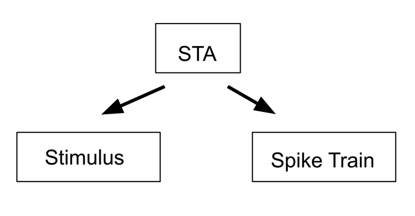

# Reverse Correlation and Receptive Field Mapping {#Ch6}

## Vocabulary  

* Poisson process
* Spike train
* Peri-stimulus time histogram
* Spike count rate
* Interspike interval
* Fano factor
* Coefficient of variation
* Spike-triggered average
* White noise
* Reverse correlation

## Introduction
  Throughout our everyday lives, we receive an enormous amount of sensory inputs from our surrounding environment: the color of the clouds before sunset, the melody played by an old record player, the smell of apple pie, or the taste of your favorite dish. Our brain, with its incredible computational capacity, successfully encodes all these sensory inputs from different modalities to something we can perceive and understand, in the language of neurons. Our discussion from previous chapters noted that the language of neurons--or the neural code--consists of action potentials that are all-or-none events, and we learned how neurons fire an action potential. In this chapter, we are going to talk about why neuron fires and how to characterize and analyze these action potentials using spike trains. Based on this, we are going to discuss ways to study the relationship between outside stimuli and neural responses.  

## Spike-triggered Average  

  An essential tool for describing neurons, and how they respond to certain stimuli, is the **spike-triggered average (STA)**. The STA is the average value of the stimulus during some time interval before a spike occurs. Researchers record a neuron's activity as it responds to various stimuli. First, the researchers must determine the amount of time before a spike they want to analyze. Once the data has been obtained and the time step determined, the value of the one-time step before a spike is recorded, and averaged across trials. This value ultimately characterizes the level of stimulus necessary for the neuron to fire. It is important to note that the spike-triggered average is measuring the average level of the stimulus, not of the neuron. This calculation is based on the probability of a neuron spiking due to stimuli activity to occur in the recent past.

```{r STA-fig, fig.cap="The spike triggered average can be used to calculate both the stimulus and the spike train.", fig.width = 2, echo=FALSE}

```
  
  <div style = "float:left;width:312px">
```{r whiteNoise-fig, fig.cap="Example of a white noise stimulus using gray scale.", fig.width = 2, echo=FALSE}
knitr::include_graphics("images/whiteNoise.png")
```
</div>

  The spike-triggered average can be utilized to determine the receptive fields of individual neurons. However, when using the STA to determine receptive fields, the stimulus presented to the recording neuron must be sufficiently random. If it isn’t, any correlation in stimuli will be presented in the generated receptive field, thus skewing the result. A **white noise**, is a type of stimulus with random variation where the value at each time point is independent of all other points. White noise can be employed in these instances to provide a receptive field without bias. White noise stimuli can look different based on the neuron and the system being observed, from a series of random auditory frequencies to randomly generated pixels stimulating the visual cortex. For each set of stimuli, the value at each time point does not correlate with the values around it. For more information on spike-triggered average analyses, especially concerning receptive fields,[read this experiment.](https://jov.arvojournals.org/article.aspx?articleid=2193104)  
  
**Worked Example:**
Paul the Python has been trying to figure out what every neuron in his reptilian brain responds to for purely scientific purposes. He has found a region in his visual cortex that responds to different hat sizes (in inches). He wants to find out which diameter of hat a  particular neuron responds to (henceforth referred to as Paul's neuron). To do so, he has decided to show his neuron many diameters of hats to try and find the spike triggered average but Paul the Python doesn't have any arms so we have to help him out.  

*Solution*: First, generate random hat diameters that we will show Paul's neuron. In this problem, we will show Paul's neuron a new hat each millisecond for 3 seconds.

```{python, eval=FALSE}
import numpy as np                # Import the necessary 
import matplotlib.pyplot as plt   # libraries. Numpy is useful
                                  # for many things like generating
                                  # arrays and random numbers
                                  # Matplotlib will help with 
                                  # plotting
                                  
time = np.arange(0, 3, 0.001)  # Create a time vector for 3 seconds
                               # with a step size of 0.001 so 
                               # that each time step is one ms.
                               # (This makes conversions easier
                               # in the long run). We are 
                               # essentially showing Paul a new
                               # hat diameter each ms.

numbers = np.random.randn(len(time))  # Use np.random.randn()
                                      # to get a range of random
          # numbers that falls under the standard normal
          # distribution. The point of this step is just to get
          # a set of random values. This distribution will 
          # typically yield values between -4 and 4. We are 
          # showing Paul a new hat at every time point, so we
          # need to create a vector that is the same length as 
          # the time vector. To do this, we could hard code 3000
          # but it is better to write in len(time) in case we 
          # decide to change aspects of the experiment in the
          # future. Remember, coding is about making life easy
          # for us in the future!
          
diameters = abs(numbers)  # Since we are using a normal distribution
                          # and we can't have negative hat sizes,
                          # we are taking the absolute value of 
                          # the random hat sizes.

plt.figure()
plt.plot(time, diameters)  # Plot hat diameters against time to 
plt.xlabel('Time in s')    # show what Paul is seeing in the 3
plt.ylabel('Hat diameters in inches')  # second experiment. 
```

The resulting plot looks like this:

```{r hats-fig, fig.cap="Hat sizes shown to Paul the Python's neuron.", fig.width = 2, echo=FALSE}
knitr::include_graphics("images/hatDiameters.png")
```

Now we have to model Paul's neuron. Paul loves large floppy hats so this neuron is dedicated to detecting hats with large diameters. For this reason, his neuron will spike every time he sees a hat with a diameter over 2 inches. This neuron happens to spike 200 ms after he sees that particular stimulus. 

```{python, eval=FALSE}
Paulsneuron = np.zeros(len(time))  # The neuron is usually at 
                                   # rest. Because all we care
                        # about in this example is if the neuron
                        # is spiking, we can denote each spike as
                        # a "1" and each non-spike as a "0". This 
                        # is a placeholder for the neuron's 
                        # response, denoting that the default 
                        # value is rest.

time = np.arange(0, 3, 0.001)  # Same as above

numbers = np.random.randn(len(time)) # Same as above
diameters = abs(numbers)

for i in range(len(time) -200):  # This is a loop that will create
   if diameters[i] > 2:          # the spikes in Paul's neuron.
      Paulsneuron[i+199] = 1     # We are saying that if the value
                  # of the current diameter is greater than 2, 
                  # Paul's neuron will spike (i.e show up as 1).
                  # These values will be saved in the Paulsneuron 
                  # vector. Because neurons can't spike instantly, 
                  # we will delay the spike for 200 ms. This is why
                  # we write [i+199]. As we are getting 200 fewer 
                  # values, we have to subtract 200 from the range
                  # or else we would be trying to index by a negative
                  # time value, and we would get an error.
                  
# Plotting time versus Paulsneuron in order to see the spike train
plt.figure()
plt.plot(time, Paulsneuron)
plt.xlabel('Time in s')
plt.ylabel('Model Neuron Response')
                                 
```

The resulting plot looks like this:  

```{r paulSpike-fig, fig.cap="Simulated spikes from Paul's neuron.", fig.width = 2, echo=FALSE}
knitr::include_graphics("images/paulSpike.png")
```

Now we have our stimulus (hat diameters that Paul was exposed to) and our response (how his neuron responded to them). We can use this information to find the spike triggered average.  

```{python, eval=FALSE}
spikes, = np.where(Paulsneuron == 1)  # Find all the places where 
                                      # Paul's neuron equals 1, 
                        # aka find where the spikes are. 
                        # The np.where() function returns a tuple.
                        # Adding a comma after the variable name 
                        # tells Python to just return the first 
                        # value in the tuple. 
                        
spikes = spikes[spikes >= 300]    # Filter out spikes earlier
                                  # than 300 ms. We decided above
                # that the neuron will spike 200 ms after the 
                # stimulus. We arbitrarily choose a value greater
                # than that so that Python can show us a chunk of 
                # time before the spike that includes when the 
                # stimulus was shown to the neuron. To expand, 
                # if we don't filter out spikes from the first 
                # 300 ms, then if there is a spike at 100ms, 
                # we can't find the stimulus at -200 ms because 
                # the stimulus begins at time = 0. 

stimArray = np.zeros((len(spikes), 300))  # We want to pre-allocate
                                          # an array that will 
                # eventually hold the stimulus from -300 ms before 
                # to spike up till the spike.

for i in range(len(spikes)): 
    stimArray[i, :] = diameters[spikes[i] - 300 : spikes[i]] 
    
# We're isolating the stimulus from -300 ms before the spike up 
# till the spike and placing it into an array.The best way to 
# understand this is by starting in the brackets. We're saying 
# to take all of the stimuli 300 ms before the spike up till the
# spike and then seeing which diameters they corresponded to. 
# This is saved in the array "stimArray". 

print("The stimArray shape is" , stimArray.shape)  # Print the 
                                                   # shape of 
                                  #stimArray to see its dimensions.

STA = np.mean(stimArray, axis = 0)  # This is where we actually
                                    # find the spike triggered 
                                    # average. We're finding the 
                                    # average stimulus that caused 
                                    # the neuron to spike. 

time = np.arange(-300, 0, 1)  # We want to see what the average 
                              # stimulus that caused the spike 
                              # looked like so we need to look 
                              # more than 200 ms before the spike. 
                              
# Plot time versus the spike triggered average.
plt.plot(time, STA)
plt.xlabel("Time (ms before spike)")
plt.ylabel("Average Stimulus Before Spike")

```

The resulting figure looks like this:

```{r paulSTA-fig, fig.cap="Spike-triggered average of Paul's neuron.", fig.width = 2, echo=FALSE}
knitr::include_graphics("images/paulSTA.png")
```

Therefore, the average stimulus that causes Paul's neuron to spike is a hat with a diameter of about 2.5 because we are selecting hats greater than 2 inches to be the stimuli that drive Paul's neuron. Python found this for us. You can see that the stimulus shows up on the graph about 200 ms before the neural response because this was how we created the simulated neuron. 

**Worked Example:**
Now that Paul knows the average stimulus that causes his neuron to fire, he wants to create a linear model of his neuron. Use the linear model to help Paul approximate the neuron's firing rate.

*Solution*: Thankfully, we can use the spike triggered average that we found in the previous problem to approximate the firing rate. This is because the spike triggered average is like a template that we use to compare with the stimulus. To do this, Paul decides to use convolution.

At first this seems difficult and could potentially require a lot of code. However, numpy built-in functions are our friend here, specifically the function np.convolve(). There are two variations of convolution that we can ask Python to do. One variation is called 'same' and the other is called 'valid'. We will explore both arguments.

By convention, when we convolve two vectors, we call the smaller of the two the *kernel* and the larger one the *signal*. Let's begin by printing the shapes of the STA and the stimulus to see which will be the signal. 

```{python, eval=FALSE}
print(diameters.shape) # reads: (3000,)
print(STA.shape)       # reads: (300,)
```

Now that we know that STA is the smaller vector, we call it the kernel and our stimulus, "diameters", is the larger vector so it is the signal. We'll begin by exploring convolution with the 'same' argument. Use the format "variablename = np.convolve(signal, kernel, 'same')"

```{python, eval=FALSE}
import numpy as np               # Import numpy library
import matplotlib.pyplot as plt  # Import matplotlib for plots

# Perform the convolution
predictedfiringrate = np.convolve(diameters, STA, 'same')

print(predictedfiringrate.shape) # print the shape so we can
                                 # compare to the 'valid' 
                                 # argument later.
                                 
# Note: the output is (3000,)
                                 
plt.figure()
plt.plot(predictedfiringrates)
plt.title('Same Argument')
```
The resulting figure looks like this:  

```{r paulConv1-fig, fig.cap="Convolution with 'same' argument.", fig.width = 2, echo=FALSE}
knitr::include_graphics("images/paulConv1.png")
```

We can repeat the process, this time using the 'valid' argument instead of 'same'.

```{python, eval=FALSE}
predictedfiringrate = np.convolve(diameters, STA, 'valid')
print(predictedfiringrate.shape)  # prints: (2701,)
plt.figure()
plt.plot(predictedfiringrate
plt.title('Valid Argument))
```

The resulting figure looks like this:  

```{r paulConv2-fig, fig.cap="Convolution with 'valid' argument.", fig.width = 2, echo=FALSE}
knitr::include_graphics("images/paulConv2.png")
```

There are a few things to consider here. The most obvious is the shape of the graphs. By looking at the graphs, you can see that the 'same' and 'valid' plots are essentially the same but 'same' has extra values at the edges.  

The 'same' argument caused the shape of the variable 'predictedfiringrate' to equal 3000 while the 'valid' argument caused the shape of 'predictedfiringrate' to equal 2701. 2701 is the size of the difference between the signal and kernel ((3000-300) + 1 = 2701). The 'same' argument compares the signal and kernel even when the kernel isn't completely lined up with the signal. A visual comparison is shown in the figure below.

```{r paulPython-fig, fig.cap="Difference between 'same' and 'valid' arguments.", fig.width = 2, echo=FALSE}

```

The figure visualizes this concept using Paul and his friend, Cody the Cobra. Paul is enjoying the sunshine and is stationary. His friend Cody the cobra is smaller in length and is slithering past Paul. Paul represents the signal and Cody represents the kernel. Convolution using the ‘same’ argument starts when Cody first begins to overlap with Paul (a). In this instance, the comparison will look at one value of the kernel and one value of the signal. As Cody continues, more parts of him overlap with Paul (b). In terms of convolution, this is like when we move the kernel over one spot and we compare the two values of the kernel to two values of the signal. Then we move the kernel by one more spot and compare three values, and so on. This is reflected in the 'same' graph when we see a steep increase in the beginning.This is because zeros are being averaged into the signal for all the points of the kernel and signal that are not overlapping. So with every increasing overlapped point, the graph also shows an increase.  

As Cody slithers past Paul, there are moments when they are completely overlapping (c and d). The ‘valid’ argument only describes these moments. For this reason, we don't get the steep edges in the ‘valid’ graph that we do in the 'same' graph. As Cody continues to slither past Paul, there will be moments when they don’t completely overlap (e and f). These moments are reflected as the decrease in the ‘same’ graph because the amount of values of the kernel and signal being compared decrease and zeros get averaged into the signal.  

Great! Now we have both a linear model and convolving the STA with the stimulus essentially provides the predicted firing rate. This is because when the stimulus and spike triggered average are similar, the convolved value is higher, suggesting that the neuron is firing. Likewise, when the stimulus and the spike are dissimilar, the convolved value is smaller, suggesting the neuron isn't firing. Now we have a prediction of what Paul's neuron should do after being shown many hats of different diameters.

## Reverse Correlation  

```{r STA2-fig, fig.cap="Reverse correlation encompasses both spike triggered averages and spike triggered covariance.", fig.width = 2, echo=FALSE}
knitr::include_graphics("images/reverseCorrelation.png")
```

  When analyzing neurons and neuronal responses, there are two main factors: the inputs (controlled by researchers), and the outputs (measured by researchers). The process of **reverse correlation** implements the analysis of outputs to determine the inputs that the neuron will respond to with a spike. The spike-triggered average is an application of this process as it looks back at the stimuli preceding a spike to determine information about the sensitivity and response of the neuron. In addition to spike-triggered average, a calculation known as spike-triggered covariance can be used to analyze neuronal responses. Spike-triggered covariance (STC) can be used to identify multi-dimensional inputs to a neuron and is especially useful in linear-nonlinear Poisson models that will be discussed later in this section. STC uses the covariance, variability between two factors, of stimuli that trigger spikes in a neuron to determine a neuron's response characteristics to multi-dimensional stimuli.  

  The basic model for reverse correlation is a Linear Single Input Single Output system (LSISOS). Such linear systems assume the two principles of homogeneity. First, the neuron will not undergo processes such as habituation and will always respond in the same way to the stimulus. Second, superposition: the response from multiple stimuli will be equal to the sum of the individual stimuli. In this model, the LSISOS response is the sum of the spikes scaled to time. Similar to spike-triggered averages, it is best to input a white noise stimulus and then cross-correlate it with its output, which will give you the spike-triggered average. In cross-correlation, the higher the similarity between the two values (the stimulus value and the output value), the greater the correlation value (the spike-triggered average).  
  
  The LSISOS model assumes a linear activity of neurons that is not entirely accurate due to neuron characteristics such as a spike threshold and a refractory period. A new model, known as the linear-nonlinear-Poisson model takes these factors into account. There are three stages to this model: linear stage, nonlinear stage, and the Poisson spike generator stage. The linear stage considers how a neuron responds to a specific feature in a spatio-temporal linear sense. The second stage takes the linear output and input through a nonlinear function to give a neuron's instantaneous spike rate. The nonlinear function can either be a logistic curve or a rectified linear (ReLU) function. The final step translates the output of the initial steps into spikes using an inhomogeneous Poisson process. The final result from the Poisson generator demonstrates the areas of the stimulus where a spike is more likely to occur.  
  Reverse correlation is a technique used for understanding what neurons are responding to, and the spike-triggered averages discussed earlier are one example of how reverse correlation is implemented.  
  
```{r STC-fig, fig.cap="Spike-triggered covariance shows how two different stimulus dimensions can be calculated together.", fig.width = 2, echo=FALSE}
knitr::include_graphics("images/spikeTriggeredCovariance.png")
```

## Summary  
  Reverse correlation and all the concepts that play a role in this widely implemented technique, from different modes of spike statistics to various types of stimuli, can be an intimidating topic in computational neuroscience. Analyzing the relationship between inputs and outputs to understand the effect each has on the activity of a neuron is the root of this topic. These analyses can move in both directions: input to output, or output to input. One can manipulate the stimulus and measure the resulting spike train through various statistical methods, or one could use reverse correlation by utilizing the known output of a spike to look back and understand the input necessary to create such a response. These analyses are working on grasping what stimuli the neuron does, or does not, “like”. In other words, they help us predict the neuron’s responses.  
  
## Exercises

### Conceptual Exercises  
1. Spike-triggered average (STA) is the average of the stimuli that preceded a spike. Describe an experimental design that would allow you to compute an STA.  
```{r linModelQuestion-fig, fig.cap="", fig.width = 2, echo=FALSE}

```
2. Above is a graph of the convolution of the stimulus intensity (horizontal speed of moving dots) and the STA obtained from the data of a fly’s H1 neuronal response to visual motion during the first 1000 time points. Convolving the spike train and STA is often used to reconstruct the firing rate. From the graph, compare the results of the convolution at point A and point B. How does the intensity of stimulus at each given time inform us of the neuron’s behavior?  
3. White noise like Gaussian white noise is often presented as the stimulus when conducting experiments to characterize the receptive field of a neuron. Provide an example of a white noise stimulus for the neurons in one of the sensory systems.  What is the importance of this technique?   
4. How is adaptation minimized in a reverse correlation experiment?  
5.	The STA functions as a linear filter to predict the neuronal response to a particular type of stimulus. This linear filtering step is often followed by a nonlinear process that is applied to our filtered stimulus in the linear-nonlinear Poisson (LNP) model. Why is this step important? In other words, what are the shortcomings of only having a linear process?


### Coding Exercises
  
**Exercise 3 (*Challenge!*)**
Match each concept to the Python function.  

Concepts:  

* Fano Factor
* Spike Count Rate
* Interspike Interval

```{python, eval=FALSE, echo=TRUE, python.reticulate=FALSE}
# Function 1
prob = 45/1000
spikeMatrix = np.zeros((1000,1000))
for i in range(1000):
  for j in range(1000):
    if np.random.rand() < prob:
      spikeMatrix[i,j] = 1
spikeCountRates = np.sum(spikeMatrix, 1)
plt.figure(figsize=(8,8))
plt.subplot(2,1,1)
plt.hist(spikeCountRates, 40, edgecolor='black')
plt.xlabel("Average firing rate (Hz)")
plt.ylabel("Frequency")
```

```{python, eval=FALSE, echo=TRUE, python.reticulate=FALSE}
# Function 2
np.var(spikeCountRates) / np.mean(spikeCountRates)
```

```{python, eval=FALSE, echo=TRUE, python.reticulate=FALSE}
# Function 3
spikeCountRates = np.sum(spikeMatrix, 1)
totalSpikes = int(np.sum(spikeMatrix, axis=None))
isi = np.zeros(totalSpikes - 1)
count = -1
for i in range(1000):
  spikes = np.nonzero(spikeMatrix[i,:])[0]
  for j in range(len(spikes)-1):
    count += 1
    isi[count] = spikes[j+1] - spikes[j]
plt.subplot(2,1,2)
plt.hist(isi, 100)
plt.xlabel("ISI (ms)")
plt.ylabel("Frequency")
```
