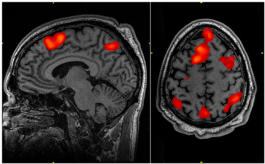
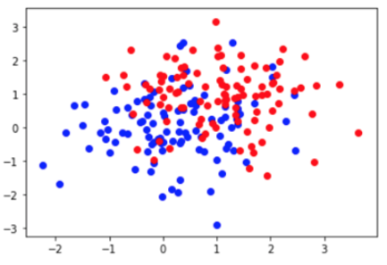

# Decoding {#Ch7}

## Vocabulary  

* Imaging techniques
  + EEG
  + MEG
  + fMRI
  + ECOG
* Multivariate Pattern Analysis (MVPA)
* Decoding
* Classifier
  + Correlation classifier
  + Distance-based classifier
  + Boundary-based classifier
* Curse of dimensionality
* Linear discriminant analysis
* Linear support vector machine (LSVM)
* Cross-validation
* Rank measure


## Introduction
  In our previous chapter on reverse correlation, we discussed how we may utilize spike trains to look back and understand the input necessary to create such a response in a neuron. We discussed the ability to not only correlate an output with a specific stimulus but additionally the capability to decode raw brain data measured via EEG, MEG, fMRI, and ECOG. In other words, for some given neuronal signals, what stimulus was provided to that neuron which caused it to fire? In this chapter, we will introduce several methods of neural decoding. In particular, we will detail the specifics of several classifiers pertinent to decoding, as well as their various benefits and constraints.

  
## Imaging Techniques
  For decoding problems, there are numerous different types of data that could be analyzed. The simplest recording of a single neuron will give a spike train that contains 0s and 1s, or we can average the rate across time bins to generate a continuous curve to study. Although it might be easier to just focus on one neuron, usually data are drawn from a population of neurons.  In some cases, a pseudo population of data is constructed from a single-neuron recording in order to reduce noise or assess group activity. As a type of supervised learning, in decoding problems, both the input and output are given, but this input can vary in its appearance. There are multiple types of imaging techniques commonly employed by researchers to obtain data and recordings from participants. We will discuss four of the main techniques here: EEG, MEG, fMRI, and ECOG.
  
  
### EEG  
<div style = "float:right;width:306px">
```{r eeg-fig, fig.cap="Raw output of EEG recording", fig.width = 2, echo=FALSE}
knitr::include_graphics("images/EEG.png")
```
</div>  
  Electroencephalography (EEG) is a method by which the electrical signals produced by action potentials across a large population of neurons are recorded to distinguish areas of activation in the brain. In an EEG setup, electrodes are placed around the scalp in a non-invasive manner to record voltage fluctuations. EEGs often record such fluctuation every millisecond, allowing for strong temporal resolution. However, since the electrodes are placed on the outside of the scalp there is difficulty with the spatial resolution of the recording. The actual output will be a sequence of voltage values over time from each electrode. This output can be decoded with multivariate pattern analysis (MVPA) where all the relationships between time points can be factored in the analysis. **MVPA** is able to be utilized for all the imaging techniques discussed in this chapter as a broad form of decoding that factors in the relationship between variables so they are not treated as independent variables. Overall, EEG is a cheap, non-invasive imaging method that is implemented in many laboratories.  
  
### MEG
<div style = "float:right;width:306px">
```{r meg-fig, fig.cap="Image of a participant in a MEG scanner.", fig.width = 2, echo=FALSE}
knitr::include_graphics("images/MEG.png")
```
</div> 
  Magnetoencephalography (MEG) is a brain recording technique similar to EEG. MEG measures the small magnetic fields produced by a population of neurons being activated together, demonstrating areas of the brain that are being highly stimulated. For a MEG scan, the machine encompasses the exterior of the participant’s head and must be completed in a magnetically shielded room as the magnetic fields produced by the brain are quite small. Similar to EEG, the output will be a time-series data that is conducive to strong temporal resolution as data is being recorded every millisecond. In this case, instead of voltage over time as in EEG, MEG will give a recording of magnetic flux over time. Since the machine is recording from outside the skull the spatial resolution and only providing data on the activation at each location the spatial resolution is weaker. MEG is more expensive than EEG but provides similar, temporally accurate, data on the activation of regions of the brain.   
  
### fMRI
<div style = "float:right;width:272px">
```{r fmri-fig, fig.cap="Image of an fMRI scan with red sections indicating areas of the brain that are more active than the control condition.", fig.width = 2, echo=FALSE}

```
</div> 
  Functional magnetic resonance imaging (fMRI) is a system that shows where oxygenated blood is focused in the brain, indicating which regions of the brain are most active. Oxygenated and deoxygenated blood have different magnetic properties allowing researchers to differentiate the two in an MRI scanner. Participants are placed in a machine that encompasses their head for the procedure to take place. fMRI scans, while external, are still able to achieve strong spatial resolution through the use of voxels. Voxels are small three dimensional sections that the brain is divided up into, and the color assigned to each voxel represents its level of activation as compared to a standard baseline. All voxels are active the majority of the time, so the output of the scan is focused on which voxels are more activated during a specific task of interest compared to this control activation. The product of an fMRI scan is an image of the participant’s brain with regions of higher relative activation indicated with color. These colored regions indicate the presence of more oxygenated blood, as greater activation requires more oxygenated blood to sustain it. Despite its successes in spatial resolution, fMRI scans have poor temporal resolution as they take six to ten seconds for blood-oxygen-level-dependent (BOLD) contrast to show changes after something happens. fMRI provides descriptive, easily interpretable imaging, but requires expensive machinery with poor temporal resolution.
  
  
### ECOG
<div style = "float:right;width:306px">
```{r ecog-fig, fig.cap="Image depicting electrodes placed on cortex for ECOG imaging.", fig.width = 2, echo=FALSE}
knitr::include_graphics("images/ecog.png")
```
</div>  
  Electrocorticography (ECOG) is a brain imaging technique that is not utilized often as it requires electrodes to be placed on the exposed surface of the cortex of a participant’s brain. The electrodes record electrical activity in the brain, similar to EEG.  However, due to the proximal location of the electrodes, ECOG is able to record with both extremely accurate spatial and temporal resolution. ECOG introduces questions regarding ethics and treatment on humans as it requires exposing the surface of the brain. Therefore, ECOG is typically only implemented on participants with epilepsy who require the placement of electrodes on their brain to record from the region where their seizures are centralized. Due to its similarity to EEG, the ECOG output would also be tracking voltage over time from each electrode. ECOG is able to provide critical data but is a difficult and extreme procedure.  
  
**Features Exercise:** What features can be used in decoding different types of data? Fill in the chart below with corresponding features for each type of data. The first one has been done for you.  

| Data Type | Features |
|-----|-----|
| Single neurons | Firing rates, spike counts |
| Population of neurons | ? |
| EEG signals | ? |
| fMRI | ? |

## Introduction to Decoding  
  With all these data from the various brain imaging techniques in hand, we want to **decode** the data--in other words, we want to detect the activity pattern buried in the random, noisy neural firing data and analyze if different stimuli lead to different activity patterns. If by analyzing activity patterns we can "predict" the stimulus that causes the activation and if the accuracy of "prediction" is higher than just random guessing, we can say that we successfully decoded the information in our brain activity recording. The word "prediction" is in quotation marks because we are not foretelling future events, but instead checking the answer key to see if our solution is correct.    
  
  Depending on the imaging techniques we used in the data acquisition phase, there are multiple ways to present and analyze data. Popular brain imaging techniques like EEG, MEG, fMRI, and ECOG all give recordings for a population of neurons, and it is the experimenter's choice to focus more on the group level or on local variance. It might be the case that whole-brain EEG data was implemented to analyze event-related brain activation, or it could be that occipital and frontal electrodes were selected to measure their correlation. Another example comes from the field of fMRI, where current interests shifted from the classical approach that explores the involvement of brain regions in certain activities to revealing the representational pattern within functional regions. Depending on the purpose of the study, different classifiers can be selected to categorize the data. **Classifiers** are algorithms that make predictions for test data based on a "learned" pattern from the training set. Here are some types of classifiers generally used in decoding.
  
## What is a classifier?  
  In order to decode brain data, we will need a classifier, which allows us to learn from labeled data and make predictions on test data from its experience with the labeled data. We will discuss three types of classifiers which each have their own strengths and weaknesses. Note that all of the classifiers we will talk about fall under the category of supervised learning, as they all make decisions based on labeled training data.    

### Correlation classifiers
  The first classifier we will examine is the simple, yet powerful correlation classifier, which works well for multivariate classifications. In a correlation classifier, the mean of each class is observed and correlated with each input feature. The class most correlated with the test item is the classifier’s predicted output. James Haxby does a great job [explaining some of the more intricate details](https://www.ncbi.nlm.nih.gov/pmc/articles/PMC3389290/pdf/nihms363224.pdf) to be aware of when implementing a correlation classifier. In practice, we consider each neuron individually as a test point and split the rest into training data. Next, we find all of the training trials for each class and calculate its respective mean. We then find the correlation coefficients between the training data and our test point and assign our predicted class to be the category with the highest correlation. We can then determine the accuracy of this classifier by evaluating the percentage of correctly classified test points.  
  
### Distance-based classifiers
  The second classifier we will discuss is the distance-based classifier, which bases its decision making on the distance calculated from the test point to the training point. One popular example of a distance-based classifier is the [k-nearest neighbors](http://www.cs.cornell.edu/courses/cs4780/2018fa/lectures/lecturenote02_kNN.html) (KNN) algorithm, where *k* is the number of training points that are closest to our test point. Each training point yields one vote to decide the class for each test point. The class with the most votes is then the resulting classification of that test point. Note that *k* is conventionally odd to ensure a majority class. To perform the algorithm, we first sample each of our training points. For each of these points, we calculate the distance to the test point. These distances are then sorted to ensure picking the k-smallest distances i.e. nearest neighbors. Finally, we take the most frequent class to be the predicted class of our test point. Before we move on to our next classifier, we must touch on one of the major pitfalls of distance-based classifiers: the curse of dimensionality. Distance-based algorithms work great in low dimensions where it is computationally inexpensive to calculate distances. The **curse of dimensionality** pertains to the fact that, as we move up in dimensions, the distances between all points to one another grow very large and the variability among distances becomes small. Therefore, your data must grow exponentially as dimensions are increased in order to sample enough of the space for these dimensions to be meaningful. It is for this reason that when working with high dimensional data, a distance-based classifier may not be the best choice.  
  
### Boundary-based classifiers
  The last of the three primary classifiers we will discuss are boundary-based classifiers, which produce some line or curve separating classes in two dimensions, a 2D plane to separate classes in three dimensions, or an abstract boundary (hyperplane) in higher dimensions. One example of a decision-based classifier is the Linear Support Vector Machine, which functions similarly to Linear Discriminant Analysis. **Linear Discriminant Analysis** works by asking what is the best line/hyperplane we can draw to separate the centroid means of our classes, whereas a **Linear Support Vector Machine (LSVM)** instead draws a boundary between the hard examples in the training set. We mentioned that distance-based classifiers are not a good choice of a classifier for higher-dimensional data. Conversely, LSVMs work well with high dimensional data; instead of calculating large distances between points, we only require a single hyperplane separating classes. Data points falling on either side of the hyperplane can be used to predict test point classes. In an LSVM algorithm, we aim to maximize the margin between the training points and the hyperplane via a cost function. Similarly to our neural network weight updating, when our LSVM misclassifies a data point, the weights determining our hyperplane are adjusted by this cost function.   
  
  One question you may be asking yourself based on the last chapter, “Wait--what about neural networks? We just learned that they can make decisions based on labeled input data!” This is a natural question to ask and the answer is in fact, yes--neural networks can function as a classification algorithm. However, when creating a classifier, the setup of a neural network is a significant hassle in terms of parameter tuning (layer size, layer count, learning rate, etc). When possible, it makes more sense to work with one of the previously discussed trivial classifiers, which are more lightweight than a neural network and work “out of the box.”  
  
## Cross validation
  We talked about that decoding means to make predictions on the test set based on the pattern from the training set. It is worth mentioning that both the test set and the training set, although all from experimental data, should be *clearly separated* during learning and predicting. Otherwise, you will fall into the circular logical fallacy. Formally this is done by **cross-validation**, a scheme that partitions the data set into the test set and the remaining data into the training set, and then predictions can be made on the test set. The training and predicting processes repeat several times to obtain a prediction for every data point. This may sound paradoxical since we mentioned that it is problematic to use A to predict A, but here since the test and training sets are clearly separated for every round of prediction, and the predicted results are *never used* for training, we are not falling into this logical trap.  
  
  Cross-validation is a decoding strategy that includes some subtypes like leave-one-out cross-validation, which is an extreme case in the cross-validation family. This method leaves exactly one sample to be the testing set and uses all other samples as the training set. It is worth noticing that when data are classified into multiple groups, one sample must be left out for every group. This is to prevent unbalancing in the training set, as an unbalanced training set may lead to a biased model. This method, while having the best chance to generalize to new examples, also requires very high computational power. A less demanding method is the k-fold cross-validation where *k* splits are made and *(k-1)* groups are assigned to the training set.  The remaining group serves as the test set. The training and predicting repeats k times, and it is generally faster than leave-one-out-cross-validation in terms of computing power. The effectiveness of the classifier is evaluated by accuracy, which is usually computed as the average correctness across all samples. Lastly, another method is the **rank measure**, which ranks the probability for all labels and measures the distance between the predicted label and the top. Sometimes it is worth noticing that higher accuracy does not mean better classification. Assume that based on some brain data we want to classify patients into two groups: "children who have ADHD" and "children who do not have ADHD". It is better to misclassify children without ADHD into the ADHD group, compared to classifying children with ADHD to the control group, as the latter one may be more deleterious.

```{r decoding-fig, fig.cap="The Logical Flow of Cross Validation. Notice that the loop continues until every group of data served as the test group.", fig.width = 2, echo=FALSE}
knitr::include_graphics("images/decoding.png")
```

**Case study exercise:** A group of researchers is studying object recognition in the inferior temporal cortex using ECOG and decoding. The neurons are not all equally responsive because an electrode array was not making full contact with the participant. What issues might this cause in decoding data? Discuss how you might fix this problem.  

## Conclusion  

  When performing neural decoding, we are aiming to determine what information about the stimulus is available in the electrical activity of neurons. There are many areas in which decoding can be applied and used to make predictions about what people are thinking, dreaming, seeing, or hearing. In the fast-moving field of Computational Neuroscience, we will likely see great strides made in decoding in all of these areas. It is paramount to our interests as Neuroscientists to be mindful of certain ethical questions as this progress is made. In China, we already see the persecution of both the Uyghur and Hong Kong populations through government-sponsored facial recognition. This abuse of facial recognition technology is a strong indicator that these decoding techniques may similarly be used in the future by malevolent actors. One potential dystopian scenario based on these methods might include crime prediction and imprisonment solely based on brain activity. It is our responsibility to be mindful of how this technology is introduced to the field, as well as the world.  
  
**Ethics exercise:** Some say that decoding could allow scientists to “read minds”. Here is [one article](https://www.sciencemag.org/news/2018/01/mind-reading-algorithm-can-decode-pictures-your-head) that refers to decoding as “mind-reading”. In light of this, what might be some ethical issues regarding the various applications of decoding? How could we potentially protect against these issues?  


**Coding exercise:** The code below codes for two separate clusters of data with means at 0.05 (blue) and 0.95 (red) which is plotted in a scatter plot. 
```{python, eval=FALSE, echo=TRUE, python.reticulate=FALSE}
import numpy as np
import matplotlib.pyplot as plt
np.random.seed(10)
m1 = np.array([0.05, 0.05])
m2 = np.array([0.95, 0.95])
sigma = np.eye(2)
data1 = np.random.multivariate_normal(m1, sigma, 100)
data2 = np.random.multivariate_normal(m2, sigma, 100)
plt.figure()
plt.scatter(data1[:,0], data1[:,1], c='blue')
plt.scatter(data2[:,0], data2[:,1], c='red')
```

```{r scatterplot-fig, fig.cap="", fig.width = 2, echo=FALSE}

```

  Based on this scatter plot and the code above, fill in the following code. The code should generate a test point from either group m1 (the blue scatter plot) or m2 (the red scatter plot). Then the distance between the generated test points and the two means should be found using the pdist() function. You can look up the pdist() function to learn more about it and its arguments.  This should be done in a for loop with 100 steps. The code additionally computes the accuracy of the decoding. This part is mostly written for you but remember to initialize the data structure and write the conditional to help determine accuracy. 

```{python, eval=FALSE, echo=TRUE, python.reticulate=FALSE}
# Importing pdist function
from scipy.spatial.distance import pdist

# Initiate data structure for accuracy
accuracy = np.zeros(   )
mat1 = np.zeros(   )
mat2 = np.zeros(   )

# Loop to classify which group the test point is in
for i in range(   ):
  # Conditional to randomly pick a point from m1 or m2
  if np.random.rand()     :
    myMean = 
    realClass = 
  else:
    myMean =
    realClass =
    
  # Define test point
  myPoint = np.random.multivariate_normal(   ,   ,   )
  
# Calculate the distance to m1 and m2 (row 0: myPoint; row 1: m1 or m2)
mat1[0,:] = 
mat1[1,:] = 
mat2[0,:] = 
mat2[1,:] = 

dist1 = pdist(   )
dist2 = pdist(   )

# Conditional to assign predicted class to be the class w/ smallest distance
if dist1   dist2:

else:

# Conditional to determine trial accuracy
if           :
  accuracy[i] = 1

# Calculate mean accuracy
meanAcc = np.sum(accuracy)/100
print(meanAcc)
```