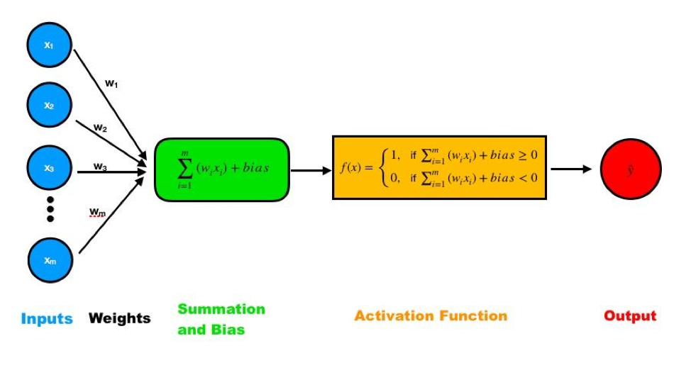
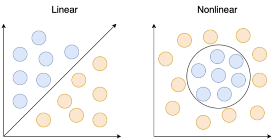
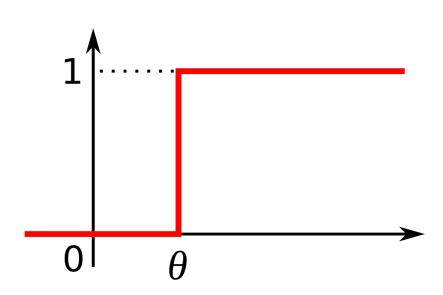
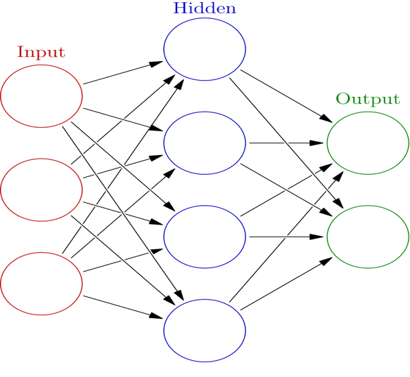

# Neural Networks {#Ch8}  

## Vocabulary List:  

* Neural network  
* Supervised Learning
* Unsupervised Learning
* Reinforcement Learning
* McCulloch-Pitt (MCP) neuron
* Perceptron
* Step function
* Linearly separable
* Activation function
* Sigmoid activation function
* Hidden layers
* Back propagation
* Cost

## Introduction/Background  
  Imagine for a moment that you wake up, groggy and not looking forward to your commute, when you ecstatically remember that you don’t have just any car, you have a [self-driving car.](https://www.youtube.com/watch?v=tlThdr3O5Qo) You slide into the driver’s seat of your Tesla and faintly pay attention as your car does the heavy lifting and drives you to work. When one considers the concept of a neural network, a biological definition may first come to mind in the sense of the neuronal connections in the brain; however, this chapter delves into how we can recreate the learning apparent in our biology through computational models. Although this may sound like a slightly intimidating goal, neural networks have become a commonly used method. They are found in a wide variety of technologies from Tesla’s self-driving cars to Go playing robots. Overall, the goal of a neural network is to identify existing patterns in stimuli or inputs and produce an output that would mirror the output of our own brain through a set of determined algorithms. This allows us to create complex neural networks that can allow algorithms with the ability to learn. In this chapter, we aren’t going to delve into the deep complexities of neural networks required to fully understand how a self-driving car works, but we will outline the basics of how machines learn through neural networks.  
  
  Neural networks identify existing patterns in stimuli. This means that based on a series of inputs, a neural network identifies whether or not the input conforms to a specific group or definition. In other words: a computer learns to perform a particular task by analyzing sets of examples. Take for example a technology that recognizes whether or not there is a face in a photograph. The neural network may ask if a stimulus has eyes, a nose, and a mouth. If the answer is yes, it will recognize the input as a face. If the stimulus lacks these features, the model will give an output to convey that there is no face. The output in this situation is the binary answer of whether or not a face exists. The more questions asked and the more layers in the neural network, the more complex stimuli and patterns we can look for. The initial example given here is a highly simplified idea of a neural network. In this chapter, we will start with the most simple building block of a neural network and build up to a more complex network.   

## Different Types of Learning  

  Before defining a **neural network**, first, let’s take a moment to consider the concept of learning. Learning is something that can be defined in a variety of ways. One definition is the acquisition or modification of knowledge, behavior, skills, values, or preferences. What does this mean in the context of deep learning and neural networks? It may be difficult to use just one definition of learning to understand neural networks, so instead let’s consider three different types of learning: **supervised**, **unsupervised**, and **reinforcement learning**. Supervised learning is where a teacher provides input and the expected outputs to a student for the student to better predict future problems. This is a system of learning which you may be familiar with, one example is when a teacher gives you both the problem and the answer for you to be able to do future problems.  Another example is computer vision learning. Giving a computer examples of different visual stimuli, such as handwriting, it can learn to distinguish between different letters using a neural network. Unsupervised learning is learning that occurs in the absence of a teacher. A student simply looks at patterns and tries to maximize correlations or find a basic understanding. **Hebbian learning** is an example of unsupervised learning. Finally, reinforcement learning is the shaping of behavior through reward and punishment. It is learning shaped through interactions with the environment. An example of this would be the robot AlphaGo which was taught how to beat humans at the game of Go. The neural networks we will be discussing in this chapter primarily use supervised or unsupervised deep learning, but if you are interested in reinforcement learning, [this video](https://www.youtube.com/watch?v=MgowR4pq3e8&feature=youtu.be) on AlphaGo is a great resource. As you continue to read through this chapter, keep the goal of neural networks in mind as well as the various types of learning which can be used to achieve this goal. 
  
**Exercise 1:** Briefly describe the different kinds of learning. Can you provide a real-world example for each? (one not mentioned in the reading.)  

**Exercise 2:** Are certain kinds of learning more capable of tackling complex issues, why or why not? What kind of questions can be addressed by individual kinds of learning? 

## McCulloch-Pitt (MCP) Neurons  
  **MCP neurons** were some of the first examples of artificial neurons that can be used to build networks. MCP neurons are named after Warren McCullough and Walter Pitts, who together proposed the model in 1943. Pitts self-taught logic and mathematics. He eventually ended up doing research at the University of Chicago, despite adverse conditions growing up. When he met Warren McCullough, a professor at the university, McCullough suggested that Pitts come to live with him and the two began a research partnership through which they produced their concept of the MCP neuron. The MCP neuron is a simple analog of its biological counterpart. The neuron receives one or multiple inputs which are then summed up to produce an output. These summed inputs essentially tell the neuron whether or not to fire. 
  
  It is, however, slightly more complicated than a yes or no question as to whether the neuron fires. Each input is multiplied by an assigned weight. These resulting values are then added up. The model then compares the actual summation to an already existing threshold value. If the sum of the various inputs multiplied by the weights is greater than the threshold, the neuron is considered to be firing. If the sum is less than the threshold, the neuron does not fire.  The equation is shown below: $$Output = 1 \ if\ \sum x_{i} w_{i} < threshold  $$
  $$Output = 0 \ if\ \sum x_{i} w_{i} \geq threshold $$
**Exercise 3:** How does an MCP neuron work? How similar is it to a real-life neuron?  

**Exercise 4:** Before we delve into further details about neural networks, what do you think could be some of the potential limitations of MCP neurons?  

  MCP neurons function as effective and simple building blocks but they do have certain limitations. Let’s consider a neural network designed to recognize a human face again. MCP neurons can ask certain types of questions to answer the question of whether or not something has a human face, such as:  
  
* Does this stimulus have eyes and a mouth?  
* Does this stimulus have eyes or a mouth?  
* Does this stimulus not have fur covering the entirety of its skin?

These AND, OR, and NOT questions can be answered in a binary (yes or no) manner and thus can be modeled by an MCP neuron. MCP neurons cannot, however, answer what are called exclusionary, also known as XOR questions. Let’s consider the example of a neural network that suggests movies. You have two hours to watch a movie and cannot decide between a romance or horror film. You can’t watch both due to your time constraints so you need a neural network that will suggest either a romance movie or a horror movie but not both movies. This is an example of a situation in which asking an XOR question is necessary. In this case the question specifically is:

| Romance | Horror | Possible Picks? |
|-----|-----|-----|
| 1 | 1 | 0 |
| 1 | 0 | 1 |
| 0 | 1 | 1 |
| 0 | 0 | 0 |

  The MCP neuron lacks the ability to ask an XOR question due to the nonlinear nature of its question. Earlier it was mentioned in this chapter that MCP neurons are based upon binary inputs and outputs. In the case of the XOR question, the complexity of the input-output relationships, due to the nonlinearity apparent in the question, prevents the neural networks from being able to produce an answer. Despite this drawback, there are ways to produce more complex neural networks which we will elaborate on later in this chapter.  

**Coding exercise:** Fill in the input and output for an AND gate in the following code, implement it in a Jupyter Notebook. 

```{python, eval=FALSE, echo=TRUE, python.reticulate=FALSE}
# Import useful packages
import numpy as np
import matplotlib.pyplot as plt

# Define Output and Input
X1 = np.array([ [ , ], [ , ],[ , ],[ , ] ])
Y1 = np.array([ [], [], [], [] ])
```

## Perceptron  
Before we dive into neural networks and discuss how they work and what they do, we will introduce the concept of a **perceptron** and discuss its relevance. A perceptron is an algorithm for performing binary classification based on a step function. A trivial perceptron functions as follows: 

1.	Consider a set of inputs and a corresponding set of weights:
$$Output = f(x) = \begin{cases}
1, & \text{if $\sum w_{i} x_{i} + b \geq 0$}\\
0, & \text{if $\sum w_{i} x_{i} + b < 0 $}
\end{cases}$$  

2. Take the dot product of these two sets.  
3. Add another predetermined number called bias.  
4. 4.	If the result is greater than or equal to 0, the output is 1; otherwise, the output is 0. This is the step function:  

$$Output = f(x) = \begin{cases}
1, & \text{if $\sum w_{i} x_{i} \geq threshold$}\\
0, & \text{if $\sum w_{i} x_{i} < threshold $}
\end{cases}$$

Note that in this **step function** , we compare the result of part 3 to 0. Alternatively, we can subtract b from both sides so that -b is a threshold value to compare with instead of adding bias and comparing to 0.  

```{r perceptron-fig, fig.cap="Scheme of a single-layer perceptron. Inputs are multiplied with their corresponding weight and the products are summed up plus the bias. The result is then entered in the activation function, which generates the output.", fig.width = 2, echo=FALSE}

```

**Code Exercise (continued):** Assume that bias equals to -1. Define the initial weights randomly by sampling from a uniform distribution between -1 and 1. Use the code below to get started.

```{python, eval=FALSE, echo=TRUE, python.reticulate=FALSE}
# Initialize parameters
# eta is the learning rate for your model
eta = 0.01
output = np.zeros(4)
bias = 
weights = 

# Initialize data structure to hold the accuracy of your model's prediction
accuracy = np.zeros(500)
```
Follow the summation and bias function above in Figure 1, fill in the blanks inside the for loop:  

```{python, eval=FALSE, echo=TRUE, python.reticulate=FALSE}
# Calculate the output for the summation and bias function
output =           + np.matmul(   ,   )
# Input the output in the activation function,
# the result will be the prediction of this model based on the
# given inputs.
output = 

# Denote the prediction as yHat
yHat = 

yHat = np.sign(output)/2 +0.5
```

  We just described what is known as a single-layer perceptron. This type of perceptron produces outputs that are **linearly separable**. This means that there exists some line that can be drawn between our two output sets. Note that this is only the case if there are two input dimensions. With three input dimensions, the data “live” in a 3D scatterplot, and it requires a plane to separate the classes. In more than three dimensions, a hyperplane is necessary. Single-layer perceptrons can solve simple problems like representing logic operators AND, OR, and NOT. However, these single-layer perceptrons are incapable of solving a more complex problem such as XOR because the outputs cannot be produced from a linear combination of inputs (the outputs are not linearly separable).  
  
**Exercise 5:** What is the difference between a single layer perceptron and an MCP neuron?  

**Exercise 6:** Explain how a perceptron functions. Which step contributes most to the “learning” process?  

```{r linSep-fig, fig.cap="A visual demonstrating the distinction between linearly and nonlinearly separable problems. The left image shows a linearly separable problem that can be solved with a single line. The right image shows a nonlinear problem that cannot be solved with a single line.", fig.width = 2, echo=FALSE}

```

  One of the major shortcomings of the single-layer perceptron is its **activation function**. We already mentioned the activation function of the single-layered perceptron as being a step function: 

```{r stepFunction-fig, fig.cap="Graph of a step function that can only oscillate between 0 and 1. The function begins at 0 and then at some time theta directly rises to 1.", fig.width = 2, echo=FALSE}

```

The main fault of the step function, however, is that it cannot represent small changes in the weights to reduce error and approach the optimal solution. This is because the activation function is not differentiable. Therefore, if there is an error in the output, changes made to the weights are constant and are not dependent on the change in input.  

  Now consider a multilayer perceptron with a differentiable nonlinear activation function. If the activation function is differentiable, then you can make gradual changes to the weights and bias so as not to overshoot the optimal solution. Consider an alternative activation function:  
  
```{r sigmoid-fig, fig.cap="Graph of a sigmoid function that gradually changes between 0 to 1 in a curved line.", fig.width = 2, echo=FALSE}
knitr::include_graphics("images/sigmoid.png")
```
  We call this the **sigmoid activation function**. While the step function has an output of either 0 or 1, the output of the sigmoid function is continuous between 0 and 1. There also exists some threshold for decision making in both functions. Another distinction between sigmoid and the step function is that sigmoid is a smooth curve that is differentiable everywhere. This allows us to be able to make slight adjustments to our weights. Thus, the process of tuning weights and bias is gradual and leads to better learning in these networks.  

  Earlier we explained a single-layer perceptron as having a step function, which is just one of many possible activation functions. When our output is not linearly separable, which is the case in most real-world problems, we chain layers of neurons together and use multiple nonlinearities from the various units to solve the problem–these added layers are known as **hidden layers** . Each of these hidden layers–as well as the output layer–will have its own activation function, and will make a decision based on some input (neural feature). The output of this function is mapped between 0 and 1 where 0 means the feature is not present and 1 means it is present, given a differentiable activation function. Non-linearity is required as we are attempting to produce a non-linear decision boundary between two sets (see \@ref(fig:sigmoid-fig)). Furthermore, if we only use linear activation functions, we can add any number of additional layers to our network and the final output is simply a linear combination of the initial input data. In other words, if we had no activation functions and we were to merely pass the weights from layer to layer, the output would be a linear combination of the inputs.  

```{r neuralNetwork-fig, fig.cap="Example of a multilayer network. (Glosser.ca, 2013)", fig.width = 2, echo=FALSE}

```

**Exercise 7:** Why is it that the activation function produces linear data? Why is linear data a problem with respect to real-world situations? 

  In 1986, Hinton et al published [“Learning representations by back-propagating errors.”](https://www.iro.umontreal.ca/~vincentp/ift3395/lectures/backprop_old.pdf) This paper introduced two concepts that allow for these non-linear activation functions to learn more complicated features. The first being the addition of hidden layers, as mentioned earlier, to the perceptron. These are nodes representing neurons in the network between the input and output. It is these hidden layers explicitly that allow for multilayer perceptrons i.e. neural networks, to learn more complicated features (like XOR). The second of these concepts is **backpropagation**, a procedure to repeatedly adjust the weights to decrease the difference between the network output and the desired output.  
  
  Backpropagation is performed by calculating the **cost** of an output neuron. One example of a cost function is Mean Squared Error, which allows us to calculate cost via:$$ MSE = \frac{1}{n}\sum_{i=1}^{n}(Y_{i} - Yhat_{i})^2$$

In the cost function, $Y_{i}$ is the output of our activation function and $\hat{Y}_{i}$ is our desired output. We take the output of our cost function and use it to make changes in our weights with the goal of minimizing cost for the next iteration through our network. Note that in order for backpropagation to be possible, our activation function must be differentiable between 0 and 1 e.g. the sigmoid function, but the step function is not. For a detailed explanation of how backpropagation works, check out [this video.](https://www.youtube.com/watch?v=tIeHLnjs5U8&feature=youtu.be) 

**Exercise 8:** Explain why backpropagation and hidden layers are necessary for the perceptron to optimize its learning capabilities. 

**Exercise 9:** Why is the sigmoid function a better alternative than the activation function for multilayered perceptrons? 

**Exercise 10:** Think back to real neurons. How does a multilayered perceptron compare to an actual neural network? What strengths does it have, and what weaknesses? 

**Code exercise (continued):**  
Below is the completed for loop following from the previous code snippet.  Note the manner in which we updated the weights.  

```{python, eval=FALSE, echo=TRUE, python.reticulate=FALSE}
  # Calculate the error between predicted y and your expected Y1
  error = (Y1 - yHat)

  # Compute delta weights. This step is where the
  # model starts to 'learn' based on the difference
  # between expected output and the actual output.
  # Delta weight will be the change of weight. It is
  # based on input value and error size.

  deltaW = eta * np.matmul(X1.T, error)

  # Update weights
  weights = weights + deltaW

  # Store accuracy for the prediction along iterations
  accuracy[i] = len(error[error==0]) / 4
  
# Plotting
plt.figure()
plt.plot(accuracy)
plt.xlabel('iterations')
plt.ylabel('percent accuracy')
```

## Summary
  Neural Networks have come quite far in the last half-century. What was initially thought to exist exclusively in the brain can now be replicated in an algorithm. It was not until the creation of the McCulloch-Pitts neuron, followed by the extension into the perceptron before people were convinced that a machine could learn. People initially believed that the perceptron is useless as they could not represent logic as simple as XOR with their single layer. It was not until Geoffery Hinton pioneered the creation of the multilayer perceptron that artificial neural networks were respected as a strong representation of how a computer can learn. Hinton and his collaborators are responsible for many of the significant leaps in programming computers to learn. The introduction of backpropagation and hidden layers to neural networks allowed for substantial progress to be made in the field of Artificial Intelligence.  
	Neural networks are perhaps the most hyped topic in the tech world today. As we journey further into the 21st century, we are constantly bombarded with headlines and news feeds of self-driving cars, [agents teaching themselves to play hide and seek](https://openai.com/blog/emergent-tool-use/), and [the greatest chess engine the world has seen that taught itself to play in a few hours](https://deepmind.com/blog/article/alphazero-shedding-new-light-grand-games-chess-shogi-and-go). There is no doubt that it is an exciting time to be a neuroscientist; we are at the forefront of considerable innovation and it all emerges from the material discussed in this chapter.  

**Coding Challenge**
Following the code given in this chapter, try to make a model for an XOR gate. Does the accuracy change when you do more iterations? Explain your result. Hint: consider the term “linearly separable”.

