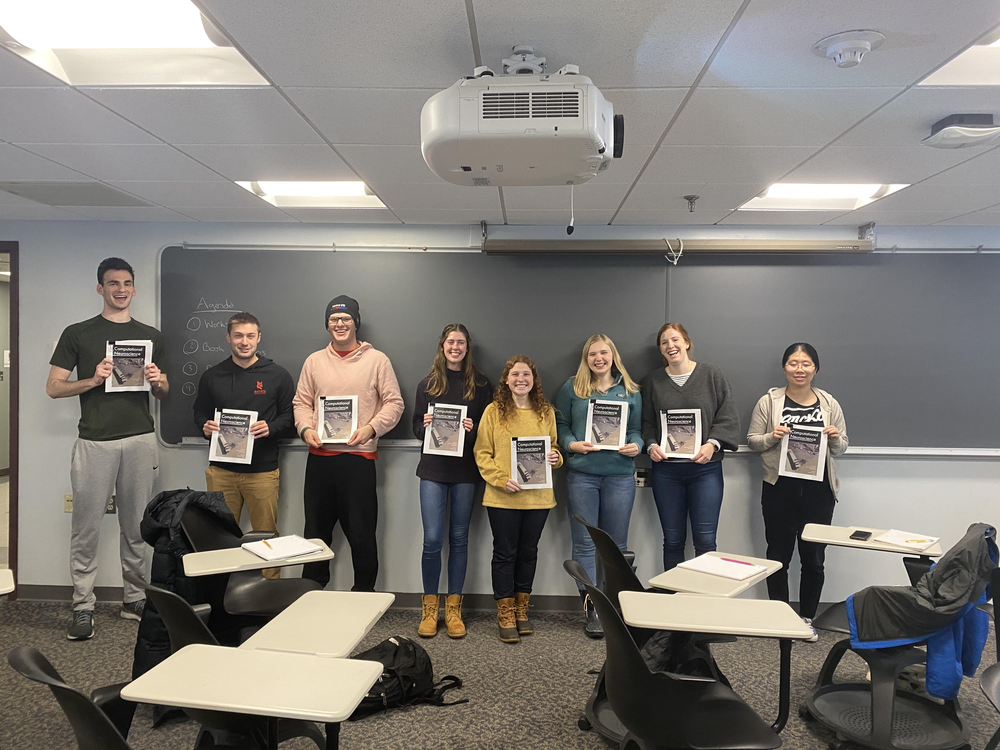
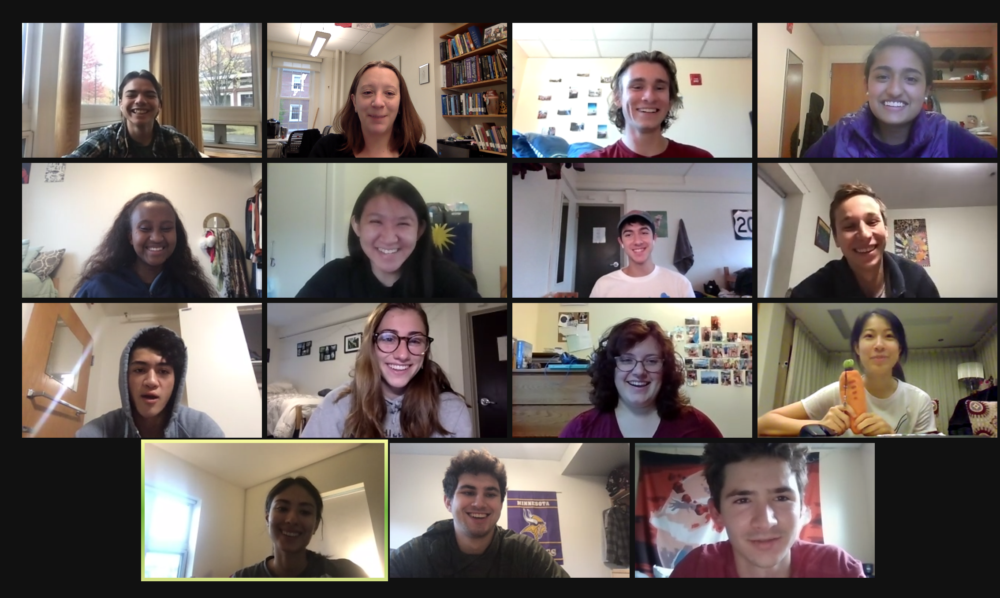

--- 
title: "Computational Neuroscience"
author: "Students of NS/PY 357 Bates College"
date: "`r Sys.Date()`"
site: bookdown::bookdown_site
output: 
  bookdown::pdf_book:
    keep_tex: yes
  bookdown::gitbook:
    lib_dir: assets
    config:
      toolbar:
        position: static
output_dir: "docs"
documentclass: book
bibliography: [book.bib]
biblio-style: apalike
link-citations: yes
github-repo: mrgreene09/compNeuroTextbook
cover-image: "images/cover.png"
description: "TBD"
always_allow_html: true
---

# Preface  
  What you are about to read is an open textbook written for (and by) students of Computational Neuroscience at Bates College. This is version 1.0 of a living document that will be revised, reused, and appended over the course of many generations of this course. As the instructor of this course, I want to briefly outline *my* motivations for undertaking this project in hopes that this idea may spread.

## This book is free (as in pizza)  
  It is broadly accepted that [college affordability](https://collegecost.ed.gov/) is a key challenge for the U.S. in the 21st century. One of the drivers of increased college cost is the increased cost of course textbooks. Over the past 40 years, textbook prices have risen over [1200% over the last 40 years](https://www.slideshare.net/kcangial/teaching-in-the-open-bates-college) -- much higher than the rate of inflation, and higher even than housing or healthcare! By creating a free textbook, we are broadening the participation of students in computational neuroscience.  
  
  While this was true when we began this project in 2019, it is even more true as we face a global pandemic and recession in 2020. I am very happy to be opening up knowledge on this topic as the world seems more closed. As the class reflected on their work, a number of additional novel reasons for this project emerged: reducing the environmental impact of creating and shipping paper textbooks, and the health implications of sharing physical textbooks during a pandemic.  

## This book is free (as in speech)  
  As important as cost-free textbooks is, equally important are the freedoms that openness provides. We are opening this resource for reuse, revision, and redistribution. We welcome others to remix into other works. It is my belief that the availability of high-quality resources allows for creativity and innovation to spring up in others. My teaching and scholarship has benefited greatly from openly available sources, and I feel that my success as an academic is to pay this forward.

## This book can be revised and disseminated more rapidly than traditional textbooks  
  Part of the impetus of this book came from a frustration in finding a traditional textbook that was appropriate for my undergraduate, 300-level course in computational neuroscience. Many of the books, though excellent, assumed a graduate-level sophistication in mathematics. Nearly all were missing some of the most modern topics. Computational neuroscience is a rapidly-evolving field, so an open textbook allows for more rapid editing, addition, and dissemination than is afforded by a traditional publishing model.

## This book creates a public record of learning that exists after the semester ends  
  Part of the educational journey is making the leap between being a *consumer* of knowledge to being a *generator* of knowledge. It is oft-said but nonetheless true statement that one truly learns by teaching. This assignment places students in the role of teacher, making the content come alive by explaining it in their own words. All too often, the writing that we do in college is in the form of the “disposable assignment” - one that students will spend a few hours working on, that I will spend a few hours reading and grading, and then is thrown away. Writing an open textbook is more of a renewable assignment - one that will have value in the world long after the semester is over.

  We hope that you enjoy this book. Please feel free to reach out to me if you have any questions or comments about our work: mgreene2@bates.edu.

## Authors: Version 0.0
Juliet Bockhorst (2022)  
Abraham Brownell (2020)  
Paloma Noriega Burrill (2021)  
Catherine Crossin (2020)  
Leo Crossman (2020)  
Logan Douglas (2020)  
Nick Antonellis (2021)  
Robin Kass (2020)  
Sasha Cadariu (2021)  
Wuyue Zhou (2021)  

  

## Authors: Version 1.0  
Ciaran Bardong (2022)  
Camden Bibro (2022)  
Natalie Brewer (2021)  
Yueh Chuah (2022)  
Alexis Fifield (2021)  
Neeshi Hullavarad (2022)  
Jahmari Josiah (2021)  
Johnny Loftus (2022)  
Adam Mann (2021)  
Amina Mohamed (2022)  
Alexia Perugini (2022)  
Shanzeh Rauf (2021)  
Peter Riley (2022)  
Sobie Sobolewski (2022)  
Riley Strathmann (2022)  
Dessy Yang (2022)  

\
 This work is licensed under a <a rel="license" href="http://creativecommons.org/licenses/by-nc-sa/4.0/">Creative Commons Attribution-NonCommercial-ShareAlike 4.0 International License</a>.

